# How dft works

`dft` shows what AI coding work cost on each git branch, across Cursor, Claude Code, Codex, OpenCode, Pi, OMP and DeepSeek Harness. It keeps three money numbers apart: an estimate at the model maker's public price, the tool's own figure, and what a tool billed. Each section below answers one question with one picture.

## Contents

- [Where does the data come from, and where does it go?](#where-does-the-data-come-from-and-where-does-it-go)
  - [Where does the data come from?](#where-does-the-data-come-from)
  - [What happens on its own, and what only when you ask?](#what-happens-on-its-own-and-what-only-when-you-ask)
  - [What does dft write, and where?](#what-does-dft-write-and-where)
  - [What leaves your machine?](#what-leaves-your-machine)
- [How do I set it up, and what is a normal day?](#how-do-i-set-it-up-and-what-is-a-normal-day)
  - [What do I do once, per repo?](#what-do-i-do-once-per-repo)
  - [What does install change in my repo?](#what-does-install-change-in-my-repo)
  - [What does install print?](#what-does-install-print)
  - [How do other worktrees get set up?](#how-do-other-worktrees-get-set-up)
  - [What happens on a normal day?](#what-happens-on-a-normal-day)
  - [What do I see when I commit?](#what-do-i-see-when-i-commit)
  - [How do I check the cost?](#how-do-i-check-the-cost)
- [How does cost land on the right branch?](#how-does-cost-land-on-the-right-branch)
  - [What happens when a chat keeps going after `git checkout -b`?](#what-happens-when-a-chat-keeps-going-after-git-checkout--b)
  - [What about parallel agents in separate worktrees?](#what-about-parallel-agents-in-separate-worktrees)
  - [How does it place work done before `dft` was installed?](#how-does-it-place-work-done-before-dft-was-installed)
  - [Which commits count when a branch starts from another feature branch?](#which-commits-count-when-a-branch-starts-from-another-feature-branch)
- [What do the numbers mean?](#what-do-the-numbers-mean)
  - [Where does each money number come from?](#where-does-each-money-number-come-from)
  - [What does it look like in the terminal?](#what-does-it-look-like-in-the-terminal)
  - [Why are they never added up?](#why-are-they-never-added-up)
  - [Where do the prices for the estimate come from?](#where-do-the-prices-for-the-estimate-come-from)
  - [Which tokens are counted?](#which-tokens-are-counted)
  - [What does a dash mean?](#what-does-a-dash-mean)
  - [How is the model and reasoning level read for each turn?](#how-is-the-model-and-reasoning-level-read-for-each-turn)
  - [What happens in Auto mode?](#what-happens-in-auto-mode)
- [Which command answers which question?](#which-command-answers-which-question)
  - [Which command do I run?](#which-command-do-i-run)
  - [What if it is not set up yet?](#what-if-it-is-not-set-up-yet)
  - [What does `dft analyze` print?](#what-does-dft-analyze-print)
  - [What does `dft line` print?](#what-does-dft-line-print)
  - [What does `dft history` print?](#what-does-dft-history-print)
  - [Where do the other commands fit?](#where-do-the-other-commands-fit)

## Where does the data come from, and where does it go?

Everything `dft` reads lands in one store on your machine, and every report is built from it.

### Where does the data come from?

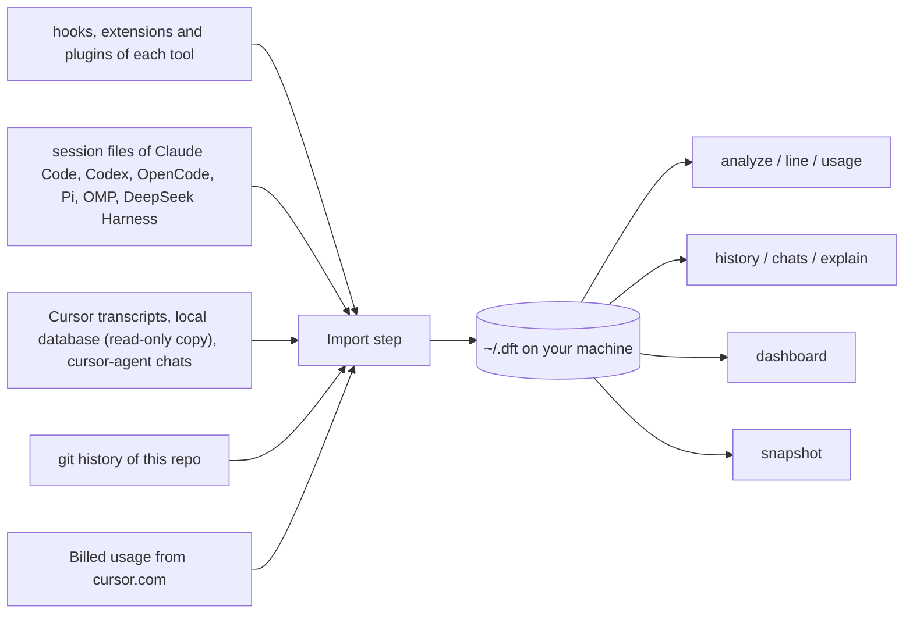

Everything `dft` reads ends up in one local store, `~/.dft/dft.db` (or `$DFT_HOME/dft.db`). Every report is built from that store, and nothing has to be imported by hand.

### What happens on its own, and what only when you ask?

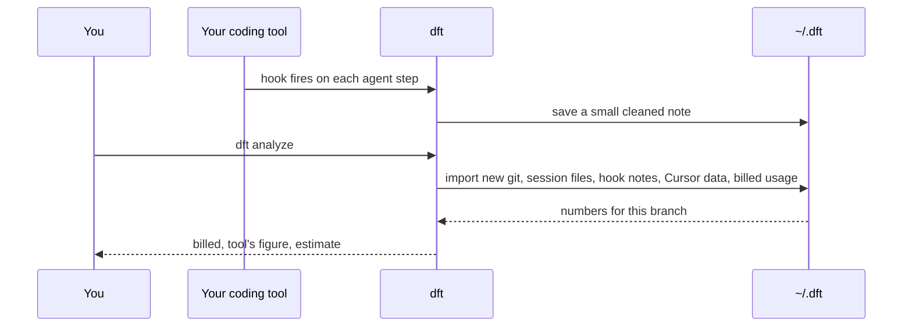

While you work, each tool calls `dft hook` (through its hooks, extension or plugin), which saves a small cleaned note. When you run any report, `dft` first imports whatever is new, then answers. Add `--no-sync` to skip the import and use only what is already stored.

| Source | When it is read |
| --- | --- |
| Hooks, extensions and plugins of each tool | automatic, while you use the tool |
| Session files of Claude Code, Codex, OpenCode, Pi, OMP and DeepSeek Harness | automatic, before each report, only what changed; `dft dashboard` also syncs a few seconds after a session writes |
| Cursor chat transcripts | automatic, before each report |
| git history (all worktrees of the repo) | automatic, before each report |
| Billed usage from cursor.com | automatic, before each report, if you are logged in to Cursor and use the default `~/.dft` store |
| Cursor local database | automatic, before each report, only chats from this repo's worktrees |
| cursor-agent chats | automatic, before each report, per turn, for this repo's worktrees |
| OpenTelemetry from Claude Code and Codex | only after `dft install --telemetry`, while `dft dashboard` runs |

Session files are read where each tool keeps them (for example `~/.claude/projects` or `~/.codex/sessions`), and only sessions that ran in this repo are kept. The Cursor local database holds chats from every project. `dft` never opens the live file for writing: it reads a backup copy in a scratch folder, removes the copy afterwards, and keeps only the chats that ran in a worktree of this repo. cursor-agent keeps a chat store per folder it ran in, so `dft` reads only the stores of this repo's worktrees and records each turn on the branch it ran on. The Cursor local database also holds your Cursor login, which `dft` reads for the usage request.

### What does dft write, and where?

```diff
 your-repo/
+├── .cursor/hooks.json        # dft install: adds "dft hook" entries, keeps yours
+├── .cursor/skills/           # dft install: the /dx-* skills
+├── .claude, .codex, .opencode, .pi, .omp, .dsh   # hooks or extensions for the tools found
+└── git hooks folder          # pre-commit and pre-push, only with --git-hooks
 ~/.dft/
+├── dft.db                    # the store every report reads
+├── spool/                    # Cursor hook notes, one folder per worktree
+├── hooks/                    # hook notes of the other tools, one folder per tool
+├── snapshots.jsonl           # dft snapshot results
+├── price-catalog/            # saved copies of the public price list
+├── cursor-usage-api/         # where the Cursor usage import last stopped
+└── dashboard.html            # dft dashboard --one-time
```

Inside your repo, `dft` writes only the capture files above (and your git hooks if you ask). They are listed in this clone's `.git/info/exclude`, so they are never committed. It never writes your user settings (`~/.cursor`, `~/.claude`, `~/.codex` and so on) unless you run `dft install --telemetry`, which keeps a backup. `$DFT_HOME` moves everything under `~/.dft` above. Outside `~/.dft`, only `dft dashboard` runs the Cursor usage import. `dft install --all-worktrees` sets up every worktree of the repo in one go.

### What leaves your machine?

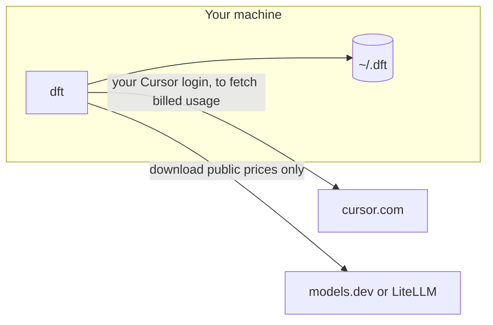

Only two requests go out: your usage from cursor.com, and a public price list (at most once a day; offline, a built-in list is used). No chats, code or usage are uploaded anywhere, and your Cursor login is sent only to cursor.com and never stored. Turn off the usage request with `DFT_CURSOR_USAGE=off`.

## How do I set it up, and what is a normal day?

You set `dft` up once per repo; after that it records on its own while you work.

### What do I do once, per repo?

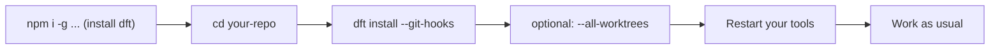

`dft install` sets up Cursor hooks and the `/dx-*` chat commands, and local capture for every other tool it finds on this machine. `--git-hooks` also records and prints the branch cost on every commit and push. Restart Cursor (or run **Developer: Reload Window**) and start new sessions in your other tools so they load the hooks. Codex and Pi load project hooks only in a folder you trust; `dft install` says what is still needed.

### What does install change in my repo?

```diff
 your-repo/
 ├── .cursor/
+│   ├── hooks.json             # adds "dft hook" next to your own hooks
+│   └── skills/                # /dx-analyze, /dx-chats, /dx-dashboard, /dx-explain, /dx-history, /dx-line
+├── .claude/settings.local.json # Claude Code hooks, if Claude Code is found
+├── .codex/hooks.json          # Codex hooks, if Codex is found
+├── .opencode/plugins/         # OpenCode plugin, if OpenCode is found
+├── .pi/extensions/            # Pi extension, if Pi is found
+├── .omp/extensions/           # OMP extension, if OMP is found
+├── .dsh/                      # DeepSeek Harness hook bridge, if dsh is found
 └── .git/
+    ├── info/exclude           # keeps every file above out of git
+    └── hooks/                 # only with --git-hooks
+        ├── pre-commit         # + one line at the top: dft snapshot </dev/null || true
+        └── pre-push           # + one line at the top: dft snapshot </dev/null || true
```

Only files inside the repo change, never your user settings. Existing hooks are kept: `dft` adds its own entries and leaves yours alone, and a file tracked by git is never written. In git hooks the `dft` line goes right after the `#!` line, so your own checks still decide whether the commit goes ahead. If the repo uses lefthook, `dft` prints a snippet for you to add instead.

### What does install print?

This is real output of `dft install --git-hooks` in a fresh repo on a machine with Claude Code and Codex (the path and the ignored-file list are shortened, and the closing contact line is left out):

```text
dft is set up in ~/code/your-repo

Set up
  ✓ Cursor hooks    .cursor/hooks.json
  ✓ Cursor skills   /dx-analyze, /dx-chats, /dx-dashboard, /dx-explain, /dx-history, /dx-line (in .cursor/skills)
  ✓ Git hooks       pre-commit, pre-push (record cost on each commit)

Tool capture (this folder only, never committed)

Claude Code
  ✓ .claude/settings.local.json created: added dft hook to SessionStart, SessionEnd, Stop, SubagentStop, PostToolUse

Codex
  ✓ .codex/hooks.json created: added dft hook to SessionStart, SessionEnd, Stop, SubagentStop, PostToolUse
  Codex reads .codex/hooks.json only in trusted folders, and this one is not trusted yet: trust it when Codex asks on start, then approve the hooks in /hooks. dft did not change ~/.codex.

Git
  ✓ ignored by git in this clone only: /.cursor/hooks.json, /.cursor/skills/dx-analyze/SKILL.md, ..., /.claude/settings.local.json, /.codex/hooks.json

Not found on this machine, so skipped: OpenCode, Pi, OMP, DeepSeek Harness. Add one anyway with --tool <id>.

Next steps
  1. Work as usual  in your coding tools, on a branch
  2. dft analyze    cost of this branch
  3. dft history    cost of every branch
  4. dft dashboard  the same as a web page
  5. dft --help     all commands
```

Without `--git-hooks`, the git hooks line is missing and an **Optional** block suggests `dft install --git-hooks`.

### How do other worktrees get set up?

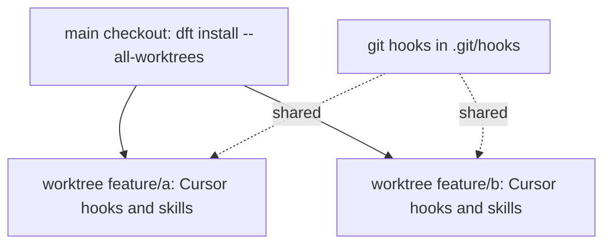

The capture files are never committed, so a new worktree does not get them. An agent started in the main checkout records its subagents in other worktrees too. For a worktree you open on its own (its own Cursor window or `cursor-agent`), run `dft install --all-worktrees` once, and again after you add worktrees; `dft install` without the flag lists the worktrees that are not set up yet. Git hooks live in the shared `.git/hooks` folder, so every worktree already uses them. Session files of the other tools are read for every worktree of the repo, with or without hooks.

The hooks call the Node and `dft` paths that ran `dft install`. If you switch Node versions, run `dft install` again: it points every `dft` hook at the current Node and `dft`.

### What happens on a normal day?

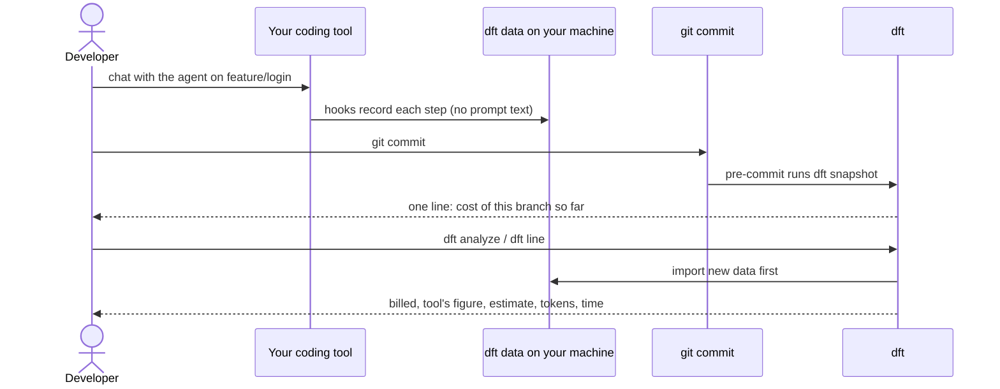

You never start or stop anything: the hooks record while you work. Every `dft` report first imports what is new (git, hook notes, every tool's session files, the Cursor local database, Cursor billing), so numbers are fresh (add `--no-sync` to skip that). The line `dft` adds to your git hooks ends in `|| true`, so it never blocks a commit.

### What do I see when I commit?

```text
$ git commit -m "Add login form"
dft: feature/login  $1.84 billed · $2.10 est · 1.2M tokens · 42m agent · 3 chats · 4 commits
[feature/login 3f2a9c1] Add login form
```

Numbers are an example; the shape is real. A branch with no AI work yet prints `dft: feature/login  no AI usage yet · 1 commit`. Each snapshot is also saved in `~/.dft/snapshots.jsonl` (or `$DFT_HOME/snapshots.jsonl`).

### How do I check the cost?

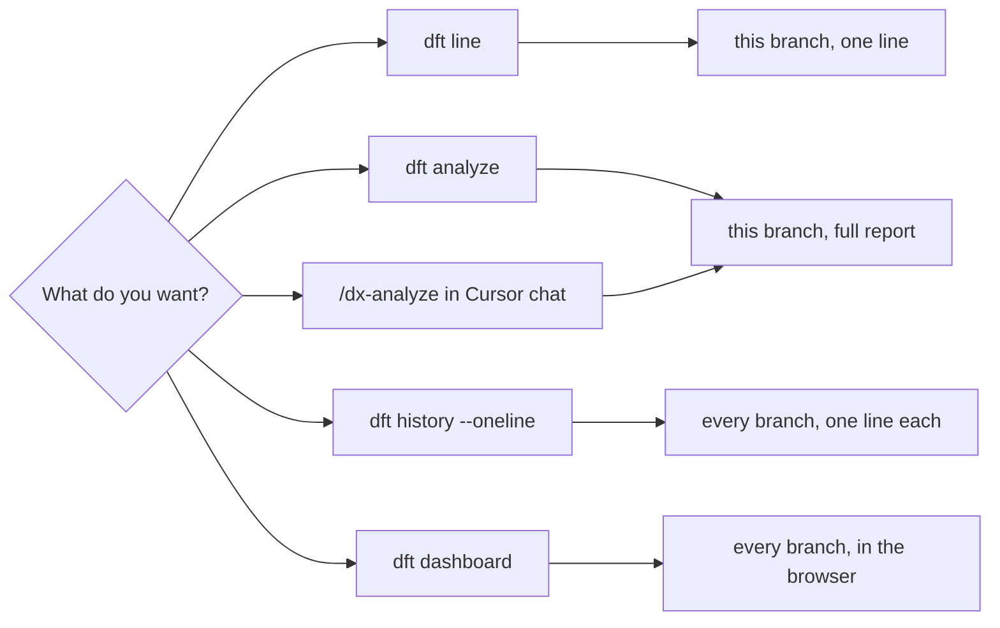

`dft line` is the same as `dft analyze --oneline` (or `-1`). `dft history` covers this repo; add `--all-repos` for every repo and `--since 30d` to limit time. `dft dashboard` opens a live page on `http://127.0.0.1:7420` that keeps syncing; `--one-time` writes one page to `~/.dft/dashboard.html` instead.

## How does cost land on the right branch?

`dft` never asks you to mark where work starts or stops. It looks at the time of each request and asks git which branch was checked out in that folder at that moment.

### What happens when a chat keeps going after `git checkout -b`?

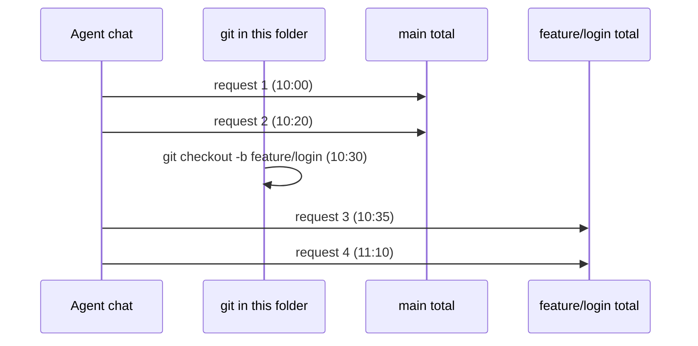

The chat is not moved as a whole. Each request is counted on the branch that was checked out when it ran. So one chat can add cost to two branches.

### What about parallel agents in separate worktrees?

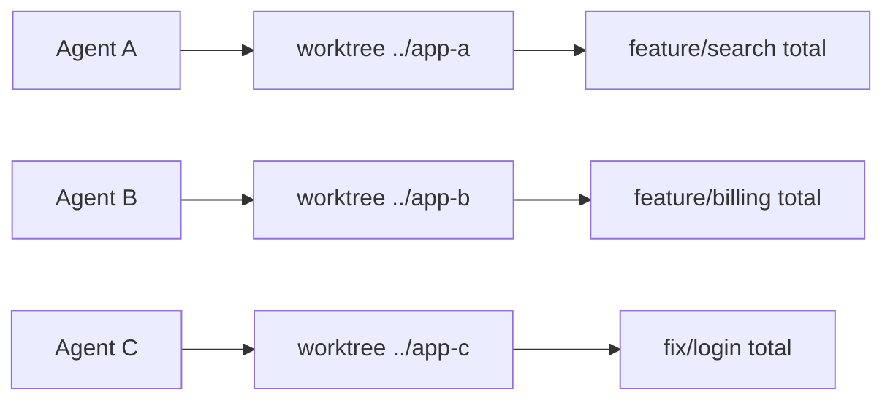

Each request is matched to a worktree by its folder and the file paths it touched, then to the branch that worktree had at that time. Every worktree has its own checkout history, so the totals stay apart. A subagent that works in another worktree is counted on that worktree's branch and shows as its own chat under its parent in `dft chats`. `dft install --all-worktrees` sets up every worktree at once.

`dft history --oneline` (or `-1`) then prints one short line per branch:

```text
feature/api-docs  no AI usage yet · 2 commits
```

### How does it place work done before `dft` was installed?

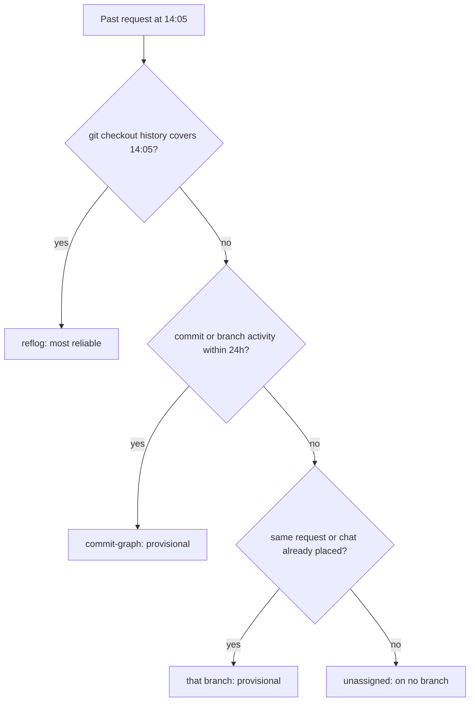

`reflog` is git's own record of each checkout, so it is the most reliable; a request made while no branch was checked out (detached HEAD) stays unassigned. `commit-graph` picks the branch with the nearest commit or branch activity within 24 hours either side, using only commits that exist on one local branch, and is marked provisional. git forgets checkouts after about 90 days, so older work falls back to commits or stays unassigned.

Each event keeps that label (`reflog`, `commit-graph` or `unassigned`) with its stored record. `dft explain` shows what happened on the branch by time, grouped by source, up to 200 events:

```text
2026-09-30
  14:05  Cursor chats  1 chat, 3 prompts, 12 tool calls
  16:27  git           2 commits (+40 −3, 5 files)
```

### Which commits count when a branch starts from another feature branch?

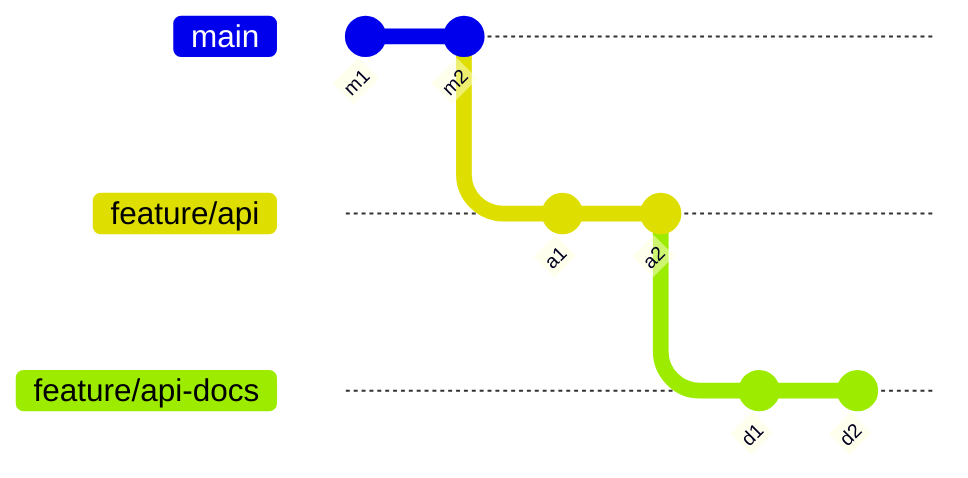

`feature/api-docs` counts only `d1` and `d2`, not `a1` and `a2`. `dft` finds the point it forked from: git's "Created from" note, the closest other local branch, or `main`/`master`; the candidate closest to your latest commit wins. So a branch that later merges its parent is not over-counted.

```text
branch            counts commits
feature/api       a1 a2
feature/api-docs  d1 d2          # from its fork point on feature/api
```

## What do the numbers mean?

`dft` shows up to three money numbers for a branch. They sit side by side and are never added up.

### Where does each money number come from?

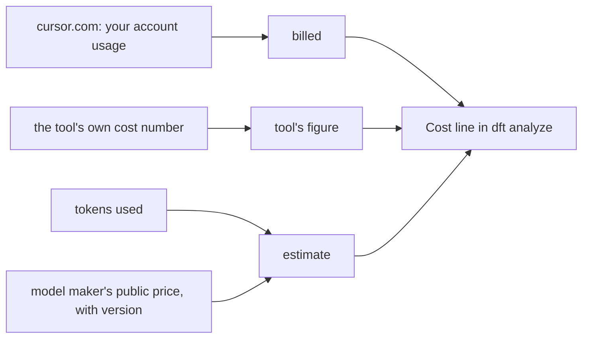

**estimate** is tokens times the public price of the company that made the model, worked out the same way for every tool so tools compare. A model reached through a gateway (OpenRouter, Copilot, a local router) is still priced at its maker's price, and a local model costs $0. **tool's figure** is the tool's own cost number when it stores one (Cursor, Claude Code, OpenCode, OMP, Pi); a running session total is counted once per session. **billed** is a real charge, today from your Cursor usage imported from cursor.com.

### What does it look like in the terminal?

```text
feature/checkout · 3 days old

Cost    $12.40 billed · $11.87 tool's figure · $14.02 estimate (list price)
Tokens  4.1M in · 22.3M cached · 310K out · 95K reasoning
Time    3d 2h on branch · 5h 10m active · 2h 45m agent
```

The three money numbers are separated by `·`. There is no total. `dft usage` names the price book and its version under its table, for example `price book maker@2026-10-01+models.dev@2026-10-01+bundled@2026-10-01`. `dft line` and `dft analyze --oneline` (or `-1`) print one line: `feature/checkout  $12.40 billed · $14.02 est · 26.7M tokens · 2h 45m agent · 1 commit`. The billed spot shows the tool's figure when nothing billed has come in yet, and the token count adds up in, cached, cache write and out.

### Why are they never added up?

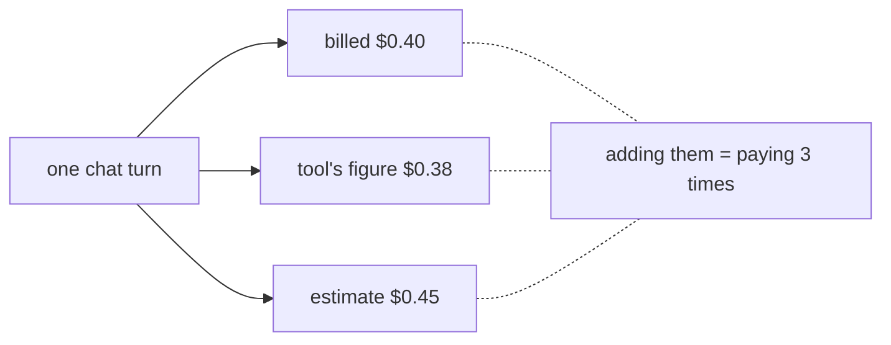

All three numbers measure the same work in different ways. A sum would count that work two or three times. Compare them instead: billed is the real cost, the estimate is what the same tokens would cost at the model maker's price.

### Where do the prices for the estimate come from?

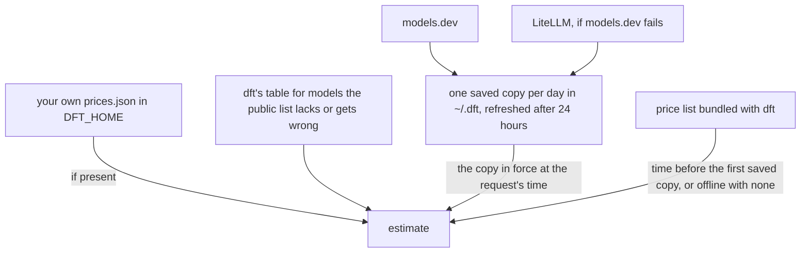

Only prices are downloaded, never your usage. Each request is priced with the saved copy that was in force at its time, so a new download does not reprice older work. The bundled list counts only as the oldest version, for time before the first saved copy, or as the only list when `dft` is offline and has never saved one. `DFT_PRICE_CATALOG=off` never downloads.

### Which tokens are counted?

```text
in           prompt text sent to the model
cached       prompt text the model already had (cheaper)
cache write  prompt text stored for later reuse
out          text the model wrote back
  reasoning    the part of "out" spent thinking (already inside out)
```

Each kind has its own price, so the estimate prices each kind separately. Reasoning is part of the output, so it is not counted twice. A kind with nothing in it is simply left off the line.

### What does a dash mean?

```diff
- Cost    $0.00 billed · $14.02 estimate (list price)
+ Cost    $14.02 estimate (list price)
+
+ Missing: billed, tool's figure. Add --verbose to see why.
```

A missing number is never shown as `0`. It is left out, or shown as `-` when a whole line has nothing. In `dft analyze`, the `Missing:` note names what is not there, and `--verbose` says why (for example: Cursor usage import is off). With no AI data at all, it says "No AI cost or tokens recorded for this branch yet" instead. `$0.00` would claim the work was free. `-` says `dft` could not see the number.

### How is the model and reasoning level read for each turn?

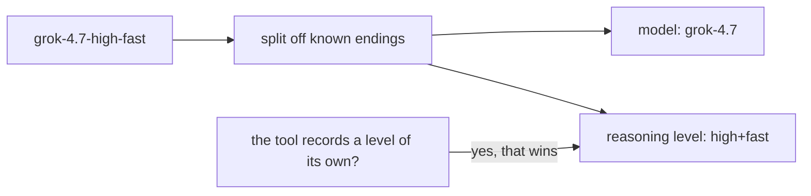

Cursor puts the level in the model name, so `dft` reads it from these known endings: `minimal`, `low`, `medium`, `high`, `xhigh`, `thinking` and `fast`. Other tools record the level in a field of its own, and a recorded level always wins. It is read per turn, because a chat can switch models halfway. `dft chats` shows it as `grok-4.7 high+fast ×3` (three turns with that model and level; Max mode adds `+max`). A model known only from the session's settings or a usage total is listed without a count.

### What happens in Auto mode?

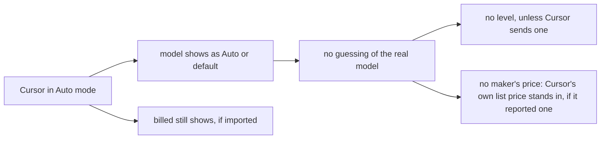

Cursor does not record which model Auto picked, so `dft` shows `Auto` (or `default`, as Cursor names it). Without a real model name there is no maker's price. When Cursor reports its own list price for an Auto request that was not billed, that price stands in as the estimate; otherwise the estimate is missing for those turns. What Cursor billed for them still shows up once your account usage is imported.

## Which command answers which question?

Every report looks at the branch checked out in the current repo. `--branch <name>` picks another branch (`history` ignores it, since it lists every branch), `--all-repos` widens it to every repo `dft` has seen, and `--no-sync` skips the import of new data that runs first.

### Which command do I run?

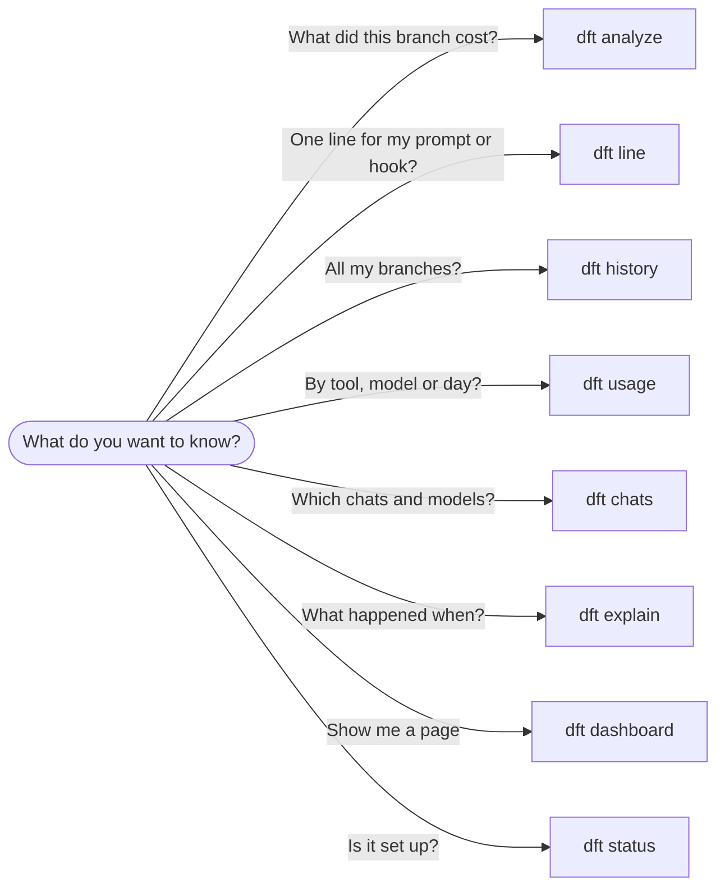

Start at the question and follow the arrow to the command. `dft line` is the same as `dft analyze --oneline` (or `-1`). `dft usage --by tool` (or `model`, `provider`, `branch`, `day`) lists tokens, requests and each money number side by side.

### What if it is not set up yet?

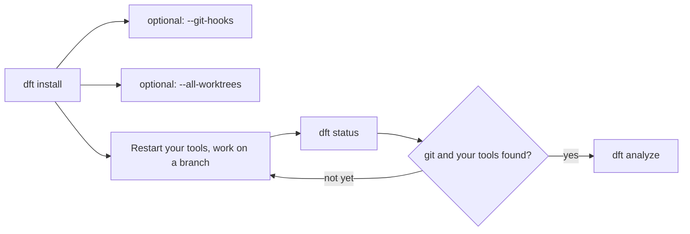

`dft install` adds Cursor hooks and skills, and capture for every other tool it finds, to the current repo only, and is safe to run again. `--git-hooks` also records the cost on every commit and push; `--all-worktrees` sets up every worktree of the repo in one go. `dft status` then shows which sources and tools it found.

### What does `dft analyze` print?

```text
$ dft analyze
feature/checkout · open · 2 days old

Cost    $4.12 billed · $4.30 tool's figure · $5.87 estimate (list price)
Tokens  1.2M in · 3.4M cached · 86k out · 21k reasoning
Time    2d 3h on branch · 5h 12m active · 1h 48m agent
Work    7 commits · 14 files · +1.2k −310 lines · 342 tool calls · 58 requests
Models  claude-4.5-sonnet 64% · gpt-5 28% · Auto 8%
```

One branch, in full. Billed, the tool's figure and the estimate sit side by side and are never added together. Model shares are by tokens. A number that is missing is left out and named in a `Missing: …` line at the end (a row with nothing at all shows `-`). `--verbose` says why.

### What does `dft line` print?

```text
$ dft line
feature/checkout  $4.12 billed · $5.87 est · 4.7M tokens · 1h 48m agent · 6 chats · 7 commits

$ dft line            # on a branch with no AI work yet
main  no AI usage yet · 2 commits
```

The same numbers as `analyze`, squeezed onto one line. Good for a shell prompt, a git hook or a status bar. Zero values are left out.

### What does `dft history` print?

```text
$ dft history --since 30d
BRANCH            STATUS  LAST ACTIVE   AGENT TIME  TOKENS  BILLED  ESTIMATE  CHATS  COMMITS
feature/checkout  open    1 hour ago        1h 48m    4.7M   $4.12     $5.87      6        7
fix/login-loop    merged  3 days ago           22m    610k   $0.48     $0.71      2        3
main              open    5 days ago             -       -       -         -      -        2

Billed is what a tool charged. Estimate is the model maker's public price for the tokens. They are shown apart, never added.
```

```text
$ dft history --oneline
feature/checkout  $4.12 billed · $5.87 est · 4.7M tokens · 1h 48m agent · 6 chats · 7 commits
fix/login-loop    $0.48 billed · $0.71 est · 610k tokens · 22m agent · 2 chats · 3 commits
main              no AI usage yet · 2 commits
```

One row per branch, newest first. `-` means no number. Add `--all-repos` to see every repo (rows read `repo:branch`), where usage from any tool that fits no branch shows as a separate "Not linked to a branch" line. `--oneline` gives the same short line that `dft line` prints, once per branch.

### Where do the other commands fit?

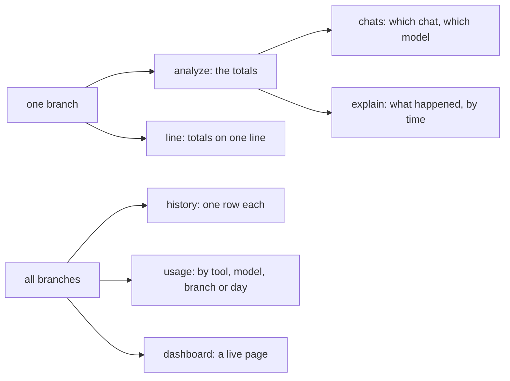

Start with the totals, then drill in with `chats` or `explain` to see where a cost came from. Every report takes `--json` if a script or an agent reads it.

_The numbers and branch names in the examples above are made up; the layout matches what dft prints._
