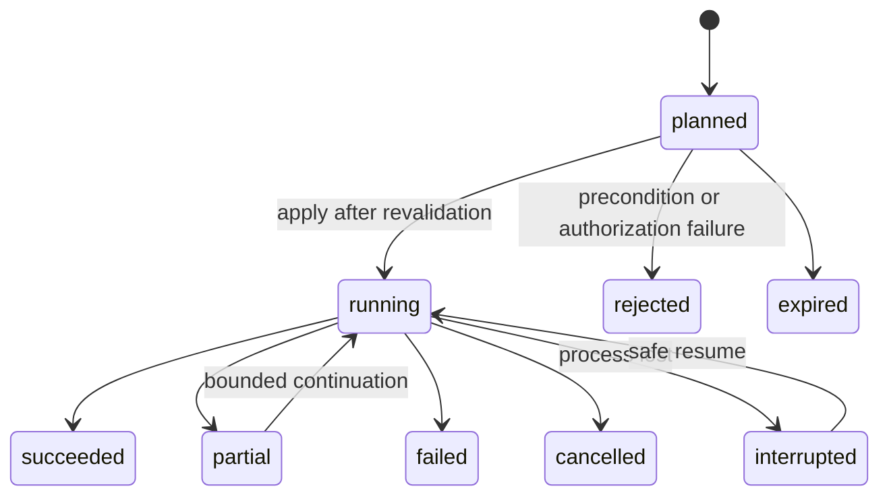

# Agent control contract

Status: execution under validation. Parent design: [agent system](agent-system.md). Implementation: S00, S01, S03 and S05 in the [follow-up plans](../../plans/agent-system/README.md).

## Control only what dft owns

`dx_operation` takes `{ request: OperationInput }` with plan, apply, get and cancel actions. CLI exposes the same request as `dft operation --request <JSON>`; MCP and the guarded dashboard dispatcher decode the same contract. Reuse existing source plans, cursors, installation, settings, export and store administration. Supported operation kinds are advertised by the installed build. A suggestion to run a local test is a recommendation for the driving agent; dft does not execute a command recovered from evidence or a lesson.

Each operation descriptor declares its kind, version, enabled state/reason, required inputs, authorization, cancellation semantics, idempotency and read/write/network effects. The retained plan binds scope, normalized arguments, limits and preconditions. The receipt contains result and verification references. Availability includes the reason a kind is disabled. Discovery does not require executing it.

The composed v1 catalog enables `collect`, `configure`, `export`, `delete`, `reset` and `restore`. Configuration includes repository enrollment, Cursor account-import policy, native Codex guidance and Cursor hook installation. Guidance and hook installation are configuration actions, not separate operation kinds. Export currently permits metadata only. The schema reserves `derive-usage`, `refresh-prices`, `live-start` and `live-stop`; their disabled descriptors state that no adapter is composed. Query-time selected acquisition and price refresh likewise return an explicit unavailable reason and operation guidance. An agent must inspect availability before choosing these actions.

Planning is read-only against tracked state, apart from declared operation-plan metadata. It does not scan unselected tool folders, fetch prices or start collection. Planning may inspect explicitly selected source metadata or content within its declared limits to bind review preconditions. It never broadens discovery or performs acquisition. A wider source probe requires a separately selected operation. Forecast work is labelled an estimate; unknown bytes, requests, duration or cost remain unknown.

## Reviewable plan

An operation plan records:

- The exact operation kind, canonical store/target identities, selected source roots and input refs, and normalized arguments.
- Its purpose, expected evidence improvement, effects, network destinations, resource limits and stop condition.
- A configuration/store/source revision or content digest for each precondition that matters.
- Existing consent applicable to this scope, additional authorization required if any, and exact deletion/backup scope for destructive actions.
- Safe complete-record resume boundaries, retry limits, cancellation behavior and expiry.
- A plan ID and canonical plan digest. An idempotency key is bound to the same digest and target.

Readiness, freshness and permission are different. Existing enrollment permits routine selected-source acquisition without repeatedly asking. Installing user-level telemetry, widening scope and destructive actions preserve their specific authorization rules. A changed policy cannot be accepted by reusing an unrelated consent receipt.

Apply names the reviewed plan ID, its expected digest and idempotency key. Revalidate preconditions immediately before effects under the existing serialized writer. A stale plan returns a typed reason and a replan recovery action. It never applies a newly recomputed deletion scope behind the old confirmation text.

Bind plan IDs, idempotency reservations, get/cancel and continuations to store ID and generation. Reset or restore explicitly invalidates pending plans and continuations. Restored data never revives expired consent or authorizes replay of completed external effects. Keep the reset/restore journal recoverable outside its deletion scope, in the approved backup manifest and resulting generation.

Receipt recovery may follow a retained generation alias. An exact consumed plan/digest/key can return its original receipt and reviewed plan after reset, including through the dashboard. This does not revive an unconsumed plan or repeat its effects. A missing historical receipt or plan remains an explicit limitation.

Storage schema 8 adds an index for aliases by operation ID and preserves compatible retained bases. Invalidation flattens valid aliases to the current receipt identity while retaining their original bindings. Each operation body has a 256 KiB default decode/write limit. Alias history can grow with operations and generations, and reset work grows with retained recovery metadata. V1 has no total alias-count or byte cap and performs no automatic recovery-journal eviction. Deleted evidence, basis and result bodies remain deleted.

Do not invalidate a safe append-only import merely because unrelated observations arrived. Preconditions depend on the operation: deletion binds selected content and backup policy; configuration binds file contents; import binds source identity, cursor and parser version. The plan must state whether new source data within the approved bounds is permitted. Path reuse or a changed input outside that rule requires replanning.

## Durable execution



Keep plan validity, execution state and verification state as separate fields. `succeeded` means declared effects completed, not that every requested source became available. Verification records committed observations and gaps. Cancellation leaves already committed batches visible and records remaining work. A timed-out client must recover the operation by ID before choosing a retry.

Running journals bind a persisted writer-owner identity. Opening another process leaves a live owner unchanged. Recovery requires evidence that the prior owner closed, exited or was replaced; uncertain liveness remains conservative.

Store idempotency reservations before effects. A repeated key and identical plan returns the existing operation or receipt; a changed digest returns a conflict. Single-writer serialization protects local commits. External/file effects use a per-step journal and atomic writes where possible. After a crash, verify an indeterminate effect instead of promising universal exactly-once execution.

Identical concurrent acquisitions share work only when source, normalized scope, parser version, read policy and bounds are compatible. Each caller retains its own authorization and receipt reference. Store mutation is serialized. Do not hold a write transaction open during filesystem scanning or network requests.

A cancelled or timed-out caller detaches from shared acquisition. Work continues only for remaining authorized callers within their own caps. Sharing never widens another caller's scope or budget. Reuse unchanged acquisition results rather than create a durable operation for every idle polling cycle. Journals have explicit size/retention rules while unfinished and destructive operations retain the recovery evidence they require.

## Receipt and verification

```text
OperationReceipt
  schemaVersion, id, storeId, storeGeneration, revision
  planId, planDigest, idempotencyKey
  executionState, verificationState, startedAt, completedAt
  beforeRevision, afterRevision, cancellationRequested, recovery
  steps: source, state, inserted, duplicates, rejected, committedThrough
         spooledRefs, safeCursor, gaps, retries, remainingWork
  effects: filesChanged, configDigest, evidenceIds, backupIds, backupArtifacts
           exports, exportArtifacts, removedRefs, removedCount
           remainingStoreGeneration, removalReason
  resources: bytesRead, recordsDecoded, requests, retries, elapsedMs
  verificationRefs, resultingBasisId
```

`get` returns the receipt and its `reviewedPlan`, with an explicit reason when the retained plan is unavailable. Resolve the plan through the receipt binding, including historical reset/restore aliases. This is a read-only recovery path. A fresh agent can inspect the original scope, arguments, bounds and failed preconditions before planning again. Historical lookup never makes an old plan valid for apply.

Counts alone are insufficient. Distinguish committed, spooled, rejected, partial, unavailable, not-attempted and already-applied work. A zero inserted count can mean unchanged data, duplicate replay, failed acquisition or durable spool fallback. The receipt must say which.

The current metadata export binds a retained basis and a canonical destination under the selected worktree `.dft/exports/` directory. It records its disclosure policy and content digest. Redacted evidence and selected-learning exports remain unavailable until an enabled adapter advertises them. A delete/reset has its exact removed IDs/counts, backup identity, restoration compatibility and remaining store generation. Backups and durable event data are not disposable build outputs. Retention/cleanup is explicit; no resource-optimization rule authorizes deleting existing user data.

The dashboard previews that exact export plan before saving and retains its basis, destination and retry key. A lost response leaves the reviewed plan available for receipt recovery or a retry with the same key. A verified result, confirmed cancellation or invalidated review permits an explicit new preview. An uncertain response never silently creates another plan or destination.

Keep dashboard loopback/origin/session-token protections, typed destructive confirmation and backup behavior. Route actions through the same capability/service as CLI and MCP. Confirmation establishes consent for one reviewed scope; it cannot authorize a different plan after state changed. Existing UI confirmation mechanics remain until an equally explicit mechanism is implemented and tested.

## Cost-aware next steps

An action candidate cites the gap or disagreement it could resolve, required source/access, likely scope of work and the evidence criterion for stopping. Prefer a recorded drilldown before acquisition, incremental import before full replay, and a targeted source before all-repo scanning. Do not invent expected saved minutes or a numeric information-value score.

One internal work budget spans authorization, validation, recovery probes, execution and verification. Every stage receives the remaining allowance; repeated previews cannot reset it. Receipt measurements distinguish known zero from unavailable work. Operation `maxRequests` and receipt `requests` count bounded native command and HTTP invocations. A local Git validation needs that allowance even when the plan declares no network destinations. Query `maxNetworkRequests` counts network requests only. After restart, effects requiring an unreconstructable remaining allowance require replanning.

Historical Build7 did not satisfy this requirement for nested ownership-Git invocations in guidance and hook configuration. Those helpers also used a synchronous timeout that could wait indefinitely after SIGTERM. Their replacement passed admission, attempted-command counting, output bounds and hard termination with child reaping, including a ready child observed ignoring SIGTERM. Old unused adapter plans refuse before target resolution; retained terminal receipt recovery remains available. The accepted [release receipt](../execution/phases/s07.json) records this verification separately from earlier successful observations.

Byte limits bound data admitted for capture and decoding. HTTP acquisition checks each response chunk before retaining or decoding it, aborts on overflow and never replaces account observations from a partial response. Known chunk overflow appears as a gap. Physical socket traffic remains unobservable.

Git acquisition bounds selected repository roots, captured command output, normalized observations and subprocess wall time. Internal Git object/worktree I/O is unobservable and is disclosed separately. Readonly SQLite source queries cap the selected rows and their byte lengths before decoding. Their internal database and WAL reads remain unobservable. Logical input limits do not claim bounds on these physical reads.

Retries obey source-specific backoff, complete-record cursors and a caller's request/byte/time caps. Unavailable access is a terminal visible gap until configuration or source state changes. The live engine reuses the same operation service; polling and agent requests cannot multiply identical work unnoticed.

## Behavioral checks

- Two agents applying the same key get one operation and one set of committed observations.
- A client timeout followed by get/retry recovers the receipt without repeating a destructive effect.
- A configuration or deletion plan invalidated by a concurrent edit changes nothing and reports the failed precondition.
- A source that advances within an approved incremental scope resumes from complete records; truncation or identity change is explicit.
- Cancellation and process restart preserve completed batches, staged records and remaining work without claiming rollback.
- A spool fallback cannot count as verified commitment. Recovery proves append before advancing the committed cursor.
- CLI, MCP and dashboard use the same plan/receipt semantics and enforce equivalent scope/consent requirements.
