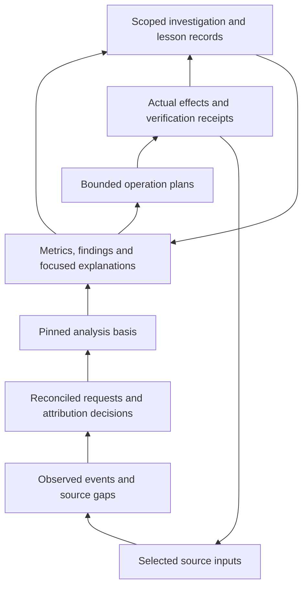

# Agent system design

Design direction requested on 2026-10-02 and implemented on `feat/agent-system`. This document and its linked query, control and learning contracts define the connected system. [Execution state](../../plans/agent-system/execution.json) records the completed producer checks and accepted release gate. Runtime capability discovery decides what an installed build supports.

## Start here

| Need | Read |
| --- | --- |
| Product intent and settled choices | [VISION](../../VISION.md), [product decisions](../product/decisions.md) |
| Understand an answer, inspect its basis, or resume a query | [Agent queries](agent-queries.md) |
| Collect, configure, export, delete, or recover an operation | [Agent control](agent-control.md) |
| Retain an investigation or evaluate a lesson | [Agent learning](agent-learning.md) |
| Implement this design | [Follow-up plans](../../plans/agent-system/README.md) and their [manifest](../../plans/agent-system/manifest.json) |
| Understand today's collection, reconciliation and pricing | [Harnesses](harnesses.md), [usage](usage.md), [capture](capture.md), [prices](prices.md) |

The product remains a local development evidence tracker. It helps an agent understand and improve a development process. The driving agent retains responsibility for code changes, running tests, and choosing experiments. dft controls its own acquisition, configuration and storage. It never turns evidence or learned prose into executable instructions.

## One connected model



Each arrow carries typed references and a declared interpretation. An answer points to its retained view and basis; the basis points to selected raw observations, coverage and interpretation versions. An operation points to its reviewed plan and journal before its effects can contribute new observations. A lesson points to authored revisions and independent evaluations. Learning contributes candidates for investigation; it cannot become an observed event or silently change a reconciliation rule.

| Term | Meaning and invariant |
| --- | --- |
| Scope | Resolved store, repository identity, worktree identity, branch selection, tool/source selection and time window. Omitted filters never grant wider authority. |
| Evidence | A selected source observation or acquisition receipt. It retains origin, source semantics, time precision and gaps. |
| Event | A normalized immutable observation. Its event ID identifies the observation, not the current interpretation of it. |
| Fact | A rebuildable reconciliation result. It identifies source winners, candidate joins, unresolved overlap and the policy used. |
| Basis | An immutable selection of evidence and all inputs needed to interpret it. It has a stable ID; computed views on it have their own result digests. |
| Finding | A supported descriptive statement or an explicitly labelled hypothesis, with metric and evidence references. |
| Operation | A bounded change to dft-owned state or an explicitly selected acquisition. Its plan, execution and verification have distinct states. |
| Investigation | A small durable record of a question, selected basis, inspected references, operations and observed conclusion. It is resumable without a transcript. |
| Lesson | A scoped claim linked to investigations and evaluations. Its status records support or contradiction without implying causal proof. |

A branch is a query label, not a durable identity. A feature remains the product's branch-oriented view. A flight ID, when present, identifies a recorded episode. A basis identifies one interpretation of that view at one resolved window. Branch renaming, path reuse and rebases must not silently rewrite older bases.

## The driving loop

1. Orient with `dx_status` and an explicit `agentQuery` profile. Read the resolved scope, descriptors, effective policies, freshness, gaps and available resume references. Completion means the agent knows the selected store/repository and whether a useful recorded answer exists. Cheap status reads cached metadata, without source discovery, event-history scans or price initialization.
2. Pin an answer through analyze or usage. Select `dx.agent.v1`, all four read policies and a work/output budget. Completion means the answer names its basis, versions, coverage, completeness and effects. Reuse the returned `basisId` for follow-up reads.
3. Inspect the disputed claim through the supported explain/evidence selectors and typed references. Preserve disclosures and each reference's resolution state. Completion means the agent can distinguish the observation, the calculation, provisional attribution and the missing evidence that matters. A reference kind in the schema does not promise a universal resolver.
4. Choose a bounded next step from the enabled operation descriptors. Prefer an available recorded explanation before collecting again. `dx_operation` planning binds the purpose, scope, effects, preconditions, consent, bounds and stopping condition. Completion means there is a concrete reviewable plan or an explicit unavailable reason.
5. Apply the authorized plan with its digest and a durable idempotency key; inspect its receipt through get/recovery. Completion means the receipt distinguishes committed observations, staged data, duplicates, rejected rows and unresolved work, and states verification separately from execution. A succeeded execution alone does not establish verified evidence commitment.
6. Request a new basis and compare it with `previousBasisId`. Completion means revision changes and comparability limits are visible. V1 compares evidence, coverage, attribution, definitions, prices, scope and window metadata. Detailed changed references and unchanged counts need a separate bounded evidence comparison.
7. Use `dx_learning` to retain a useful investigation, descriptive conclusion or experiment hypothesis. Completion means its applicability, cited basis/results, authored revision and limitations survive restart. Evaluations append independently of authored updates. If evidence supports no conclusion, retain that limit instead.

This loop has useful stopping points. An agent may finish with an accurate recorded answer, an explicit unavailable result, or a hypothesis awaiting a future observation. Acquiring every possible source is not a completion requirement.

## Trust crosses every layer

Origin, acquisition, measurement and attribution remain separate axes. Coverage and freshness are separate too. A fresh import can be incomplete; a complete historical selection can be old. A source-reported account charge can coexist with a provisional branch allocation.

Deterministic selection does not establish truth. A nearest-time association without a request key is provisional even when only one candidate wins. Preserve the original account ledger, candidates, policy, chosen association and remainder. Distinguish duplicate identity from a possible association; never erase unexplained spend by choosing a convenient join.

Preserve exact zero, unknown value, unsupported field, denied source, unsettled record, stale observation, failed acquisition and unresolved attribution as different states. Report the relevant reason at the field where the agent would otherwise draw a false conclusion.

A local runtime's zero API-price estimate says nothing about hardware cost or elapsed compute. A lower token bill says nothing by itself about code correctness. A before/after improvement is an observation with comparability limits, not causal savings. V1 cannot establish causal support for a lesson; authored criterion/outcome text remains a report even when its references are valid.

## Modules and direction

```text
apps/cli
  CLI, stdio MCP, local dashboard and host guidance
    -> shared capability handlers
      -> query composition | operation service | learning service
        -> pure attribution, usage reconciliation, metrics and comparison
          -> EventStore | AgentStore | shared harness cursor store
            <- selected collectors and harness readers
```

Contracts and model schemas describe the shared vocabulary. Storage supplies legacy `EventStore` and additive `AgentStore` from the same SQLite connection and serialized writer. Harness cursor compare-and-set and bounded source replacement use that writer too. Collectors return observations and coverage; they never compose conclusions. Reconciliation and metrics are pure relative to a basis. The operation service coordinates selected effects and existing store administration. The learning service stores and retrieves scoped records; it does not modify event truth. CLI, stdio MCP and the loopback dashboard project shared capability results.

The operation coordinator wraps existing sync, collector, cursor and administration behavior with reviewed preconditions, cumulative budgets and receipts. Declared XState Effect actors own preparing, selecting, recovering, executing, committing, cancelling and finalizing phases; the persisted journal remains authoritative after restart. Pure query transformations do not need machines. One integration owner composes these services so transport changes cannot introduce another writer or accounting path.

Use this mapping when a result or control decision needs explanation. Internal paths are navigation references; product imports use the public `@rat-stack/core/dx` export.

| Abstraction | Authoritative module and public edge | Retained identity or proof |
| --- | --- | --- |
| Scope | [Common schemas](../../packages/core/src/dx/model/agent-common.ts), [shared capabilities](../../packages/core/src/dx/capabilities.ts); selectors and response `context.scope` | Store ID/generation, resolved repository/worktree/branch/tool/source selection and absolute window |
| Observation | [Event schema](../../packages/core/src/dx/model/event.ts), selected collectors and `dx_collect` or operation collection | Raw event ID/body, evidence reference/hash, origin, field semantics and source coverage |
| Reconciled fact | [Usage derivation](../../packages/core/src/dx/usage/derive.ts); usage/explanation views | Basis reconciliation version, field winners, candidate associations, disagreements and separate account/remainder ledgers |
| Basis | [Basis builder](../../packages/core/src/dx/reports/agent/basis.ts), [query schemas](../../packages/core/src/dx/model/agent-query.ts); `agentQuery.basisId` | Immutable basis ID, watermark/event digest, retained inputs, captured prices and interpretation versions |
| Answer or finding | [Query runner](../../packages/core/src/dx/reports/agent/query.ts); analyze, usage, explain and evidence | Result ID/digest, semantic query digest, projection version, completeness and retained resolution states |
| Plan and operation | [Operation service](../../packages/core/src/dx/operations/service.ts), [phase machine](../../packages/core/src/dx/operations/machine.ts); `dx_operation` | Plan ID/digest, consent/preconditions, durable keyed reservation, receipt revision, step journal and verification references |
| Investigation and lesson | [Learning service](../../packages/core/src/dx/learning/service.ts); `dx_learning` | Authored record ID/revision, append-only evaluation target/references, applicability, canonical evidence checks and limitations |
| Persistence and recovery | [SQLite agent layer](../../packages/core/src/dx/storage/sqlite-agent-store.ts), [store ports](../../packages/core/src/dx/contracts/agent-store.ts) | Same-writer transactions, cursor/revision compare-and-set, store-generation tombstones and ownership-bound recovery |
| Public presentation | [Shared capability bindings](../../packages/core/src/dx/capabilities.ts), [CLI projections](../../apps/cli/src/surfaces.ts) | Derived input/output schemas and the same semantic result; installed-build parity has its own behavior gate |

A stored handle establishes identity, not availability or truth. Evicted or deleted content returns a typed limitation; withheld evidence remains withheld under the caller's scope. Request, metric, finding and attribution reference kinds without an indexed resolver return explicit missing or bounded-resolution reasons. Authored learning and journals do not disappear through derived-cache eviction.

## Baseline and implementation

The baseline at `eddcedb29c3900a1e5e365dc3999bf6f7fdcfd7b` had seven harnesses, a derived `usage_facts` table, a loopback dashboard and CLI/MCP queries. Human report commands usually synced first, usage could refresh derived facts, and `--no-sync` alone did not prevent price loading. These compatibility defaults remain distinct from the explicit agent profile.

The baseline snapshot manifest selected an event watermark and recorded module versions, but pinned analyze could rerun attribution against current Git and use current metric/price inputs. S02's agent bases now retain the selected observations, exact prices, resolved window and interpretation versions. Historical reconstruction checks the pinned implementation versions. Legacy snapshots explicitly retain `evidence-selection-only` reproducibility and no longer acquire stronger historical attribution by consulting current Git.

The baseline explain/evidence handlers dropped lower-level disclosures and missing-ID reasons. R00 now has shared read bindings that preserve those fields, negotiated reference resolutions, structured views and both cursor lanes. Its cheap status checkpoint and SQLite reopen continuation have owned behavior evidence. Built CLI/MCP/dashboard parity and actual host discovery remain separate checks in the execution record.

All nine implementation phases are complete. The [storage receipt](../execution/nodes/s01.json), [query receipt](../execution/nodes/s02.json), [operation receipt](../execution/nodes/s03.json) and [learning receipt](../execution/nodes/s04.json) state tested behavior and limits. S05 connects them through CLI, stdio MCP and the guarded local dashboard. The accepted [release receipt](../execution/phases/s07.json) records all eighteen passing check/test/build tasks, 2,001 passing tests, three optional live-host skips, and the same frozen artifact's native rehearsal. Operation retry recovery, investigation resume, guidance ownership and all eighteen live dashboard tests passed. Source and packaged artifact identities match, and owned temporary outputs were released and removed.

Old input omission retains legacy behavior. Agent guidance uses the optional `agentQuery` wrapper with `dx.agent.v1`, independent acquisition, prices, derivation and learning policies, and explicit budgets. Recorded-only plus cached/pinned prices performs no acquisition or network, while reporting permitted bounded basis/result/cursor writes. Fresh learning context resolves lazily for a new evaluation or candidate search, rather than adding startup work to every read.

Status descriptors and the operation catalog distinguish enabled behavior from disabled or reserved schema choices with a reason. A listed operation kind does not prove that its adapter is composed. Selected Git, account, hook, database and compressed-file acquisition paths and live routing have bounded behavior checks. Native Codex guidance installation is separate from MCP registration and observed capture. Availability claims must follow the installed build and [execution state](../../plans/agent-system/execution.json), not this document alone.

## Resource economy

Count avoidable work, not only output tokens. Cheap status reads capped cached metadata. Query selection applies scope and time filters before decoding, and warm pages read indexed retained items/series without decoding the full basis or price sheets. Bounded decoded rows do not imply constant SQL planning work; indexed metadata counts/searches disclose their limits. Learning lists return compact summaries, and lexical candidate suggestions search one bounded selected-scope page rather than loading the whole authored history.

The operation coordinator can share independently authorized compatible in-flight acquisition. Each caller retains its own scope and allowance; cancellation or detachment cannot widen the remaining callers' budget. Same-key retries use durable reservations and journals. These mechanisms do not promise exactly-once execution for every external effect. An indeterminate effect requires verification, safe bounded recovery or replanning.

Read budgets independently bound examined facts, decoded bytes, output bytes, items, series buckets, stacks, elapsed time and network requests. A plan has a separate bounded read-only allowance; apply uses one cumulative budget across authorization, validation, recovery probes, effects and verification. Source allowances cover files, bytes, records, requests and retries at the declared boundary. Historical Build7 omitted nested ownership-Git attempts from operation request counts and used synchronous termination that could exceed its timeout. The accepted repair admits and counts each attempted command, caps combined stdout/stderr, and hard-kills and reaps owned children on timeout. Git/HTTP captured-output or body bounds do not measure physical library, subprocess or network I/O. Those measurements remain unavailable when the adapter cannot observe them.

Measure handler work and caller wall time separately. Process startup, queueing and transport can add time outside a declared handler or source boundary; its elapsed counter is not the complete task cost. A spooled record proves staging, not import or presentation. Track source acceptance, committed observations and delivered results independently. A timeout without those stage observations leaves its cause unknown.

Report measured use separately from nullable plan forecasts and unknown cost. A restarted operation cannot invent counters that its durable receipt did not retain; unknown remaining allowance requires replanning before new work. Output truncation preserves complete totals only when aggregation completed. Work-budget exhaustion labels partial aggregation and offers a bounded restart at the same watermark, window and prices. Cache retention preserves stable metadata, but reconstruction can still fail because content or a supported historical implementation is unavailable.

Use a small set of public capabilities. Extend status, analyze, explain, evidence and usage; add one operation capability and one learning capability. Tool descriptions state purpose, effects, identifiers and the next useful query. Internal modules are discoverable descriptors, not one agent tool per module.

## Acceptance of the connected system

The release must demonstrate the complete driving loop on a labelled fixture and a separately selected real input. The fixture includes ambiguous account allocation, a missing source, a branch switch, a changed price sheet and a concurrent import. A fresh agent must orient, pin a summary, inspect a disputed amount, plan and execute one permitted collection, verify its receipt, compare bases, record a hypothesis and resume it after restart.

The full loop must preserve scope, field uncertainty and provenance at every step. A missing live observation remains a release limitation. Graph validation, a successful HTTP response, and a completed worker handoff cannot substitute for behavior evidence.
