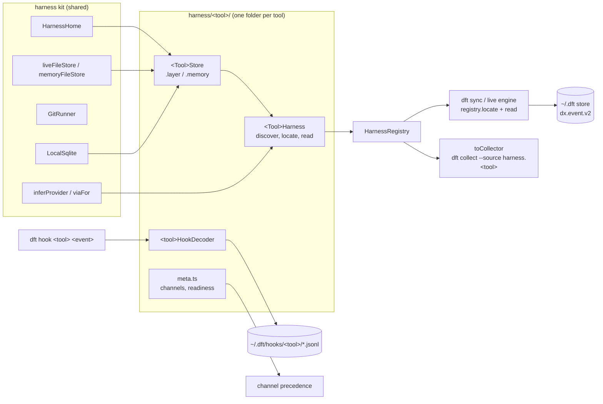

# Harnesses

A harness is one coding tool (`cursor`, `claude-code`, `codex`, `opencode`, `pi`, `omp`, `deepseek`). The UI and CLI call it a "tool" (D43). Each harness turns what its tool leaves on disk into `dx.event.v2` events. Everything lives in `packages/core/src/dx/harness/`.

## The pieces

## Event model v2

`DxEventEnvelope` (`model/event.ts`) keeps identity, flight context (`repoCommonDir`, `worktreePath`, `branch`, `headSha`, `flightId`) and a free `payload`, and adds two typed blocks (`model/attribution.ts`):

| Block | Fields |
| --- | --- |
| `ai: AiAttribution \| null` | `harness`, `harnessVersion`, `channel`, `provider` (model maker; `local` only when a local model's maker is unknown), `via` (gateway such as `openrouter`, local runtime such as `ollama` (`isLocalRuntime`), or null), `model` (normalized), `modelRaw`, `effort`, `effortSource`, `sessionId`, `parentSessionId`, `agentId`, `agentType`, `cwd`, `branchSource`, optional `touchedPaths` (see [Repo attribution](#repo-attribution)) |
| `usage: AiUsage \| null` | `requestKey`, `tokens` (`inputFresh`, `cacheRead`, `cacheWrite5m`, `cacheWrite1h`, `cacheWrite`, `output`, `reasoning` inside output, `total`; `null` means unknown, never `0`), `toolFigure` (`amount`, `currency`, `kind`: `charge`, `list-price` or `api-equivalent`), `serviceTier`, `speed`, `premiumRequests` |

Every `ai.*` event from a harness carries `ai`; non-AI events carry `null` in both. Store migration 2 (`storage/migrations.ts`, `storage/upgrade-v1.ts`) rewrites v1 rows and pending spool batches forward. Cursor's collectors (`collectors/cursor-*`) fill the blocks through `withCollectorBlocks` (`harness/collector-blocks.ts`); every other tool's harness builds them directly. Each tool has exactly one reader: the old `collectors/claude`, `collectors/codex` and `collectors/opencode` importers are gone, and `collector-blocks.ts` keeps their adapter ids only so the v1 upgrade can still read rows they stored. A stored row from one of those importers that has no request key is left out of usage facts once the tool's own harness has keyed rows for the same session, so a session imported by hand in 0.1 is not counted twice. A Cursor `metered` cost becomes the tool's figure (`list-price`), never a `charge`.

`usage.toolFigure` on an `ai.session` event (Claude Code `cost-state`, OMP, OpenCode session cost) is the session's running total. It grows on resume and is emitted again when it changes, so readers keep the largest per (tool, session) and never add them: usage facts do this and, where a session has such a total, ignore that session's per-request figures (such as Claude Code's OpenTelemetry `cost_usd`), and the legacy ledger treats such rows as aggregates. Claude Code's `cost-state` lists a cost per model, keyed by the model the user asked for, which is a router alias when a router serves the session. Usage facts split the session total by that list only when every listed model is one the session's own requests (or its subagents') used, and then take each part's provider and gateway from those requests. Otherwise the total stays whole and spreads over the session's request models like any unsplit figure. A session with no requests of its own is split by the list as reported. A request whose usage a later reading replaced names the old key in `payload.replacesRequestKey` (DeepSeek, OpenCode); usage facts and the legacy ledger drop the replaced key and its subagent-split shares (`#split:i/n`).

## The per-tool contract

Each tool folder exports, from its `index.ts`:

| Export | Shape |
| --- | --- |
| `<Tool>Store` | `Context.Service` with `HarnessStore`: `roots`, `listSessions` (path, mtime, size), `readText`, `readBytes`, `version`. `.layer` is live (needs `HarnessHome`, `FileSystem`, `Path`), `.memory(input)` is in-memory (a `MemoryFile` holds `text` or raw `bytes`, for compressed sessions). Tools with a database read it through `LocalSqlite`. A tool may widen its own store shape inside its folder. |
| `<Tool>Harness` | `Context.Service` with `Harness`: `id`, `displayName`, `capabilities` (`branchSources`, `storedFigure`, `subagents`, `liveHooks`), `channels` (this tool's precedence, best first), `discover`, `locate(scope)`, `read(ref, input)` returning an `EventBatch` of v2 events. `.layer` needs the store and may use `HarnessHome`, `LocalSqlite` and `GitRunner`; `.mock` is the harness over an empty memory store and needs no filesystem. `.mock` is its own `Layer.effect(this, this.make)`, never `this.layer.pipe(...)`: layers are memoized by reference, so a shared reference would let `registryWith(<Tool>Harness.layer.pipe(...))` silently reuse the empty mock. |
| `<TOOL>_CHANNELS`, `<TOOL>_READINESS` | `meta.ts`. Flip readiness from `unsupported` to `degraded` or `ready` when the tool reads real sessions; that also admits its `harness.<tool>` collector. |
| `<tool>HookDecoder` | `hook.ts`. `decode` turns one hook payload into `HookFields`, `kind` maps the tool's hook event name to an event kind (`other` by default), `respond` returns the stdout the tool needs (empty for most). |

`locate(scope)` returns only sessions that belong to `scope.worktrees` (every ref names one of them in `worktree`); an empty list (`everywhere`) means every session. `read` supports incremental reads: a `SessionRef` carries `mtimeMs` and `size`, and `fileCursorOf` / `readFileCursor` / `unchangedSince` encode a per-file offset in the batch `cursor`. Sync skips a ref whose `mtimeMs` and `size` match the stored cursor, unless the last batch was `unsettled`: a harness that holds data back until time passes (Claude Code's 60 s quiet rule) sets it, and sync then reads the ref again on the next run even though the file did not change. Reading the same ref twice must give the same event ids.

Channel precedence is per harness (`harness/precedence.ts` reads every `meta.ts`); it replaces the old global source list. `HarnessRegistry` assembles all seven harnesses. `HarnessRegistryLive` adds the live kit (`HarnessHome`, `LocalSqlite`, `GitRunner`) for the process home; `harnessRegistryFor(home)` anchors it at a given home and applies the user's folder variables only when that home is the user's own, so a sandbox home never reads real tool data. Sync and the live engine use `harnessRegistryFor(options.home)`, plan git sources themselves and ask `registry.locate(scope)` for everything else, then call `harness.read(ref)`. A failed `locate` shows up as an unavailable sync step.

`HarnessHome.dirs` follows each tool's own rules. OMP mirrors oh-my-pi: `ompConfig` is `~/<PI_CONFIG_DIR or .omp>` (plus `profiles/<PI_PROFILE>`), holding `stats.db`; `omp` is the agent folder (`PI_CODING_AGENT_DIR`, else `<ompConfig>/agent`) with `sessions/`; `ompXdgData` is `$XDG_DATA_HOME/omp` when that variable is set, where OMP moves its data once migrated. Pi also reads `PI_CODING_AGENT_DIR`, so when it is set without a profile both tools share one `sessions/` folder. Each file there then goes to one tool only (`harness/pi-family.ts`): OMP takes a file that shows an OMP mark (a `title` or `session_init` line, a `model_change` with `model`, an assistant message with `duration` or `ttft`), and Pi takes every other file.

## Branch precedence

Correlation (`correlation/branch-at-time/attribute.ts`) applies D28 to every harness. A branch the tool recorded on the request (`ai.branchSource: "harness-recorded"`) is kept while the request is in the worktree the session started in. Claude Code's `gitBranch` is the branch of the folder the session was launched in, not of the row's `cwd`, so repo attribution (`correlation/attribution/repos.ts`) drops it for a request whose `cwd` is in another worktree and that request goes down the rest of D28. Otherwise a hook turn of the same session within five minutes gives its branch (`hook`). Then checkout history at that time (`git-at-time`), then the folder, then unassigned. A branch the tool records once per session (Codex `session_meta.git`, the Cursor chat store) is `session-recorded`: it is kept on the event but checkout history overrides it. Each sync stores every worktree's checkout moves (a `head-moves` git observation), and checkout history joins them to the live HEAD reflog by worktree path and reflog start, so removing a worktree or adding a new one at the same path keeps what an earlier sync saw. A branch renamed while checked out (`git branch -m`, `Branch: renamed ...` in the HEAD reflog) is followed: time spent on the old name before the rename counts for the new name. When no checkout history covers the request's worktree (it was removed before any sync stored its moves), the session-recorded or folder branch stays, marked provisional, and a nearest-commit guess never overrides a session-recorded branch. A request whose stored worktree sits inside another one (Claude Code's `.claude/worktrees/`) takes only its own worktree's history, never the enclosing checkout's. `HEAD`, a full commit id, `(HEAD detached at ...)` and `(no branch)` are never branch names (`branchNameOrNull` in `correlation/attribution/branch-name.ts`): Claude Code writes `gitBranch: "HEAD"` when it has no branch, so such a row falls through to checkout history instead of winning as `harness-recorded`. Whether a request takes a hook turn is the harness rule `takesHookTurn`. Cursor keeps its phase 1 rule (only account rows joined to a session take hook turns): lifting it moves a parent agent's edits in other worktrees onto the parent's branch, which `parallel-worktrees-replay.test.ts` rejects.

## Repo attribution

Before branch precedence runs, `attributeRepos` (`correlation/attribution/repos.ts`) decides which repo and worktree each AI request belongs to. The read path runs it in `accountAwareEvents` (`correlation/branch-at-time/snapshot.ts`), so a repo's reports also pick up requests that were stored under no repo or under the wrong one, and the usage facts rebuild (`usage/load.ts`) runs it over the whole store before grouping, so `dft usage`, the dashboard, `dft analyze` and `dft history` agree. A request that its harness already placed by its own tool calls (`branchSource: "tool-calls"`, as OMP does) and that carries no `touchedPaths` keeps that place and its `tool-calls` label; checkout history then gives only its branch. The same holds for a request its harness already split across subagents (`branchSource: "subagent-split"` with a repo, as OpenCode does), so its pieces are never split a second time.

| Step | Rule | Label |
| --- | --- | --- |
| Own folder | `ai.cwd` is inside a worktree (git toplevel and common dir, asked once per path). A cwd that no longer exists keeps the stored worktree. | branch by D28 |
| Own tool calls (D36) | `ai.cwd` is in no repo: the turn's `touchedPaths` (plus any request of the same turn whose cwd is in a repo) point to exactly one repo. | `tool-calls`, branch from checkout history at that time |
| Parent (D29) | A subagent whose own folder and tool calls point nowhere takes its parent's place nearest in time. | branch by D28 |
| Subagent split (D36) | An orchestrator turn that still points nowhere is split across its subagents' repos, weighted by their tokens. Each share is a copy of the request with scaled tokens, `#split:i/n` appended to its event id and request key, and `payload.repoAttribution.inferred: true`; its branch attribution is at most `provisional`. Usage facts keep each share as its own row, count only share 1 as a request (the others carry `requests: 0` and the `splitOf` of the original), and drop other channels' copies of the split request (such as its OpenTelemetry record), so tokens, money and requests add up to the original once. OpenCode's own per-worktree pieces of one message count the same way. Each set of pieces carries `payload.splitGeneration` (a hash of its worktrees and shares) and names the whole message's key in `replacesRequestKey`, so a message stored unsplit and split by a later sync, or split again with other weights or worktrees, counts once: the unsplit reading is dropped, and of several split readings only the newest (latest `observedAt`, the newest subagent request behind its weights) is kept. Pieces stored by 0.2.0 carry `splitOf` only; they replace the unsplit reading too and lose to any newer split. | `subagent-split` |
| Nothing | Filed under the `(no repo)` project: no repo, worktree or branch. | `unassigned` |

Each moved request records `payload.repoAttribution` (`method`, `project`, `weight`, `splitOf`, the worktree it came from). `parentSessionId` and `agentId` are never changed, so chats keep a subagent under its parent.

What a harness fills so these rules work, without any prompt text:

- `ai.cwd`: the folder the request ran in, as the tool recorded it on that row.
- `ai.touchedPaths` (optional): absolute paths this request's tool calls touched, no content. Use `touchedPaths({ cwd, calls, home })` from `correlation/attribution/touched-paths.ts`: each call gives its `workdir`, its file `paths` and its shell `command` (only `cd`, `pushd` and `git -C` targets are read from commands); relative paths resolve against the workdir or cwd.
- `identity.turnId`: the turn the request belongs to (Claude Code: the `promptId` of the user row that started it; Codex: `turn_id`). Without it every request is its own turn, so a planning request before the first tool call can land under `(no repo)`.
- Subagents: `ai.agentId`, and `ai.parentSessionId` when the subagent has its own session id. A Claude Code subagent row keeps its parent's `sessionId` and sets `agentId`; a Codex child thread sets `sessionId` to its own id and `parentSessionId` to `parent_thread_id`.

## Harness rules

Generic code never checks a tool's adapter ids. It asks `rulesForEvent(event)` (`harness/rules.ts`), which finds the event's harness from `ai.harness` or, for events without an `ai` block, from the first harness whose `claims` accepts it. Each tool may supply, in `harness/<tool>/rules.ts`:

| Rule | Used by | Cursor |
| --- | --- | --- |
| `effort(rawModel, recorded)` | chat model timeline, collector blocks | model id suffix (`gpt-5-high`), `auto` explained |
| `rawUsage` | `metrics/ai-usage/normalize.ts`, collector blocks | stop-hook token fields while their semantics are unverified |
| `listPrice.field` | `metrics/cost/readings.ts` | `tokenUsage.totalCents`, the list price Cursor reports for Auto |
| `sourceKindAliases` | `metrics/cost/readings.ts` ranking | `cursor-cli` ranks as `sdk` |
| `chatRole(event)` | `chats/tree.ts` (requests, tool calls, agent time, session id kind) | hooks, local DB, CLI stream, transcripts |
| `takesHookTurn(event)` | branch attribution | never (see above) |

The defaults (`DEFAULT_RULES`) keep the model name, take effort only from a recorded field, and let every event with an `ai` block take hook turns.

## Live hooks

Tool hooks call `dft hook <tool> <event>` (plain `dft hook` still means Cursor). It reads one JSON payload on stdin, keeps only session id, turn id, cwd, transcript path, model, effort, agent id and type, the event and the branch at that moment (from git), appends one `dft.hook.v1` line to `~/.dft/hooks/<tool>/<date>.jsonl` (deleting a repo's data moves that repo's lines into the backup, reset moves every day file, and restore puts them back), never writes into the repo, exits 0 and prints only what the tool needs. A decoder may bring its own `run`: Cursor's writes its per-worktree spool (`~/.dft/spool/<worktree id>/cursor-hooks/`), so `dft hook`, `dft hook cursor <event>` and `runCursorHook` are one path. `dft install` writes the hook, extension and plugin files that call it, and `dft dashboard` receives OpenTelemetry: see [capture.md](capture.md).

The live engine (`live/engine.ts`) watches what each harness declares in `live/capture.ts`: every tool's `~/.dft/hooks/<tool>/` (a changed day file syncs the repo of its newest observation), Cursor's spool folders (`harness/cursor/capture.ts`, mapped to repos by worktree id) and Cursor's account usage poll, the only account poll today. It also watches every session root that `HarnessRegistry.discover` reports (for example `~/.claude/projects`, `~/.codex/sessions`, the OpenCode data folder with its WAL file) and syncs every tracked repo 1.5 s after the last write, so a tool whose hooks are not loaded still shows up within seconds. A root that does not exist yet (such as `~/.codex/sessions` before the first Codex run) is checked on every 2 s scan and watched, with a sync, as soon as it appears. Sync cursors skip unchanged session files, so these syncs stay cheap.

A harness turns its observations into events in two calls. `locate` adds `hookSpoolRefs(scope, id)` (one `hooks` ref per spool day and worktree, stamped with the day file's mtime and size so sync skips a day that has not changed; pass `"extension"` as the third argument when an extension or plugin calls `dft hook`), and `read` hands every ref it got from there to `readHookSpool(ref, <tool>HookDecoder, input.origin)`. Each observation becomes one event with `acquisition: "hook"`, the branch the hook saw, and an `ai` block on the ref's channel, so correlation can give the session's requests that branch. `readHookObservations(dftHome, tool)` still returns the raw observations.

## Test tiers

| Tier | Layers | When |
| --- | --- | --- |
| mock | `registryWith(<Tool>Harness.mock)` | always |
| fixture | `<Tool>Harness.layer` + `<Tool>Store.layer` over committed redacted files (`HarnessHome.at(tempHome)`) | always |
| live | `HarnessRegistryLive` over this machine, read-only, invariants only | `DFT_LIVE_HARNESSES=cursor,claude-code,codex,opencode,pi,omp,deepseek pnpm --filter @rat-stack/core test:live` |

`harnessConformance(name, registryLayer, { tier, scope })` (`packages/core/test/dx/harness/conformance.ts`) runs the shared checks: discovery never fails and names the harness, located sessions stay inside the scope, events round-trip as v2, every AI event carries attribution for this harness and one of its channels, reading twice gives the same ids, unknown tokens stay null, only tools that store a charge emit one, payloads carry no prompt or message text, branch source matches capabilities, the token ledger recognizes every usage event (a new `payload.sourceKind` must be registered in `model/ai.ts` and `harness/source-kinds.ts`), request keys are unique per channel.

## Adding a tool

1. Fill `harness/<tool>/store.ts` (roots and session filter) and `harness/<tool>/harness.ts` (`locate` and `read`; build `ai` and `usage` with `providerFor`, `viaFor`, `normalizeModel`; fill `cwd`, `touchedPaths`, `identity.turnId` and the subagent fields as [Repo attribution](#repo-attribution) describes).
2. Put redacted fixtures (real field structure, synthetic text) under `packages/core/test/dx/fixtures/harness/<tool>/` and add `packages/core/test/dx/harness/<tool>.test.ts` running `harnessConformance` at the fixture tier plus the tool's own cases.
3. Fill `hook.ts` if the tool has hooks (add `hookSpoolRefs` / `readHookSpool` to `locate` / `read`), list every branch source the tool can produce in `capabilities.branchSources`, and set readiness in `meta.ts`.
4. Run the live tier on your machine before you ship.

## Tool notes

| Tool | What to know |
| --- | --- |
| Cursor | Phase 1 collectors under `collectors/cursor-*`, wrapped by `CursorHarness`. `CursorStore` widens the store with `sources(scope)` (hook spools, transcripts, the chat store and the local databases), `present` and `reader` (the `FileSystem` and `Crypto` the collectors read with), so `CursorStore.memory` serves transcripts without touching the disk. Account rows join a hook turn only when joined to a session (`takesHookTurn`). |
| Claude Code | One ref per session family (main file plus `subagents/**`). A repo-scoped sync keeps a request from another folder's family (a parent folder such as `$HOME`) only when its folder or touched paths point into the worktree. A request is keyed by `(message.id, requestId)`, or `message.id` alone for gateway rows; the kept row has the largest output, then the cache split. A request settles when a later request or a boundary row (`stop_hook_summary`, `turn_duration`, `last-prompt`) follows it, or after 60 s of quiet; unfinished requests hold back the file offset. `cost-state` is a cumulative session figure. Web searches reach `usage.webSearchRequests`. |
| Codex | `token_usage_record` rows count only when `thread_id` is the file's own `session_meta.id`; repeats of a `response_id` count once; `token_count` is used only until the first record appears. `subagent_history_start_ordinal` is not trusted: forked history is skipped by UUIDv7 time instead. The session title from `session_index.jsonl` is part of the `ai.session` id, so chats take the newest per session. |
| OpenCode | Reads every `opencode*.db` (a copy, with its WAL) per request from `session_message` (v2) and `message` (v1). The session total minus stored requests becomes one overhead row (`opencode:<session>:overhead`, cumulative). A repo-scoped sync keeps every piece of a split message when one piece is in the repo, so each stored split is whole. Sessions outside any repo are kept when their folder, touched paths or a linked session point into the scope. |
| Pi | Sessions under `PI_CODING_AGENT_SESSION_DIR` (user home only), the `sessionDir` setting or `<agent folder>/sessions`. Pi's `totalTokens` is never summed. `harnessVersion` is the installed Pi version at sync time (see [Known limits](#known-limits)). |
| OMP | `<omp>/sessions`, gzipped archives and XDG or profile folders; `stats.db` only cross-checks. An orchestrator outside a repo is placed per turn by its tool calls (`tool-calls`) without emitting `touchedPaths`. The `ai.session` id includes the title and first model. `harnessVersion` is the installed OMP version. |
| DeepSeek Harness | Session logs are concatenated zstd frames, decoded one frame at a time (Node 24 decodes only the first frame of a buffer). Only the newest `session.vN` file per folder counts. Subagent ids have no `session-` prefix. The projection cache counts a fork's inherited history again, so dft folds the log itself. A replaced usage report carries `replacesRequestKey`. `harnessVersion` is the installed `dsh` version at sync time (see [Known limits](#known-limits)). |

## Known limits

Open points from the 0.2.0 tool work that stay open, and why:

- **Locating sessions.** Claude Code picks session families by project folder name (same folder, a subfolder or a parent of the worktree), and Codex places a session by its starting folder. A Codex session whose starting folder no longer exists (a worktree removed before the first sync) is kept by a repo-scoped sync when the repo has the commit in its `session_meta.git`; it is stored under the repo in that removed worktree with the session-recorded branch. A Claude Code session family from such a worktree (one that no live worktree holds) is kept the same way when a session started in that folder shows a commit the repo knows in its `git commit` output, or names the repo's `.git/worktrees/` folder; every family started in that folder is then stored under the removed worktree with the branch Claude Code recorded. The recorded branch name alone is not enough, because names like `main` exist in most repos. A session started elsewhere that later moves into the repo with `cd` is stored only when its requests point into the repo by `cwd` or touched paths. For a Claude Code family from a parent folder, one such request (its own or a subagent's) keeps the whole family, so D29 and D36 can place the rest. Codex code-mode `exec` scripts give touched paths by pattern match only.
- **Sessions outside every repo.** Repo-scoped syncs store a session that points nowhere only when synced from its own folder. `dft usage --repo "(no repo)"` shows what was stored.
- **Hooks in non-interactive runs.** Codex runs project hooks only in a trusted folder after the user approves them in `/hooks`; Pi loads `.pi/extensions` only in a trusted folder; `omp -p` did not load `.omp/extensions` without `-e`; `opencode run` 2.0.20 loads `.opencode/plugins` but never calls it. Session watching covers all four (see [0.2.0 validation](../execution/0.2.0-validation.md)). Codex hook payload fields for subagents are inferred from the binary, not from captured payloads.
- **Hook spool fields.** `dft.hook.v1` keeps fixed fields only, so token counts that Pi and OMP extensions see at `message_end` are not kept for the D37 cross-check.
- **OpenTelemetry.** Codex OTel records carry no response id, so they get no request key and count only for a session with no session file. OTel events carry no folder, so their branch needs a hook turn of the same session.
- **Unfinished gateway requests.** Claude Code sometimes writes only stream-start rows for a gateway request (no `stop_reason`, output 0, no cache split). Their `input_tokens` is the gross prompt, so dft keeps it as `total` only, leaves the cache split and output null and reports `request-usage-incomplete`. The estimate shows such a request as `total-only`, unpriced.
- **Turns.** A Codex turn with requests but no `task_complete` or `turn_aborted` (a crash or a killed process) gets its `ai.turn` with status `unfinished` as soon as the next turn starts, or once its session file has had no new rows for 30 minutes (the Claude Code idle rule), with a `turn-unfinished` gap. Until then sync reads the file again even when it has not changed. A turn that goes quiet for 30 minutes and then carries on keeps that `unfinished` event, though its later requests still count; in real data 7 of 4,365 finished turns had such a gap. A turn with no request yet stays open through a quiet spell, so a slow first request still ends in a `completed` event. A session that 0.2.0 already synced with a crashed last turn gets the turn event only when its file changes again.
- **Versions.** Pi and DeepSeek Harness record no tool version in their sessions, so their `harnessVersion` is a sync-time value: the version in the `package.json` of the installed package (`@earendil-works/pi-coding-agent` or `@mariozechner/pi-coding-agent`, `@deepseek-ai/dsh`) that the `pi` or `dsh` binary resolves to when dft syncs, not the version that wrote the session. dft looks on `PATH` (only for the user's own home), in the bun, pnpm, npm and `~/.local/bin` folders, then in proto, nvm and fnm Node installs (newest first). It is null when the tool is not installed there, and an event keeps the version of its first sync.
- **Subagents.** Fresh `ypi` children cannot be linked to their Pi parent (only a trace id joins them). OMP subagents share the parent's folder, so OMP never needs a subagent split. An OpenCode orchestrator message keeps the split of the sync that stored it: later subagents change it only when a sync reads the message again (a first sync of another scope, or the newest row at the cursor). A split reading also wins over a later unsplit reading of the same message (when its subagents' worktrees are gone), so its pieces keep the worktrees they had.
- **Legacy ledger.** The cost metric still names Cursor's Auto list price `cursor-list-price`; it only affects `dft analyze --json` internals. The legacy ledger (`metrics/cost/readings.ts`, `metrics/ai-usage`) reads `event.usage` first and falls back to `payload.tokens` only for events without typed usage, and drops a request a later DeepSeek reading replaced, so its tokens and requests match usage facts. Like usage facts, it bills Cursor's imported charge and uses Cursor's list price as an estimate only for requests whose own figure is a list price, never for a billed request.
- **Usage facts refresh by family.** Only the families of sessions that new events touch are derived again (see [usage facts](usage.md#usage_facts)), so an untouched family keeps the attribution it got when it was last derived until a new event, new checkout history in its worktree or a new derivation version reaches it. Memory follows the largest family (an orchestrator with all its subagents), and an all-time query without filters still decodes every fact.
- **Prices.** OpenAI Fast (formerly Priority) and Ultrafast use each model's listed ratio (gpt-4o's dated snapshots use gpt-4o's), and a model OpenAI does not list for Fast is assumed to be 2x. Flex and Batch are 0.5x, checked against OpenAI's pricing page on 2026-10-02; Batch lists no cached-input price for gpt-4.1, gpt-4o and their minis, gpt-4.1-nano, o1, o3, o3-mini and o4-mini, so their Batch cache reads price as Batch input. Flex and Batch on a model OpenAI does not list for them are still assumed 0.5x, and the 10% regional-processing and FedRAMP uplifts are not modelled. DeepSeek peak hours are doubled on weekdays from the peak/off-peak card of 2026-08-16 16:00 UTC (earlier requests use the flat V4 rates), but Chinese public holidays are not modelled, so a peak-hour request on a holiday is priced at twice its cost. DeepSeek snapshot names (`-0731`, `-0813`) and V4.1-Flash names price as their base model. Prices the public catalog lacks or gets wrong (retired Claude 4 and 3.5 models, DeepSeek V4-Pro and Flash with their dated rates) live in `price-book/maker-sheet.ts`; it and `bundled-catalog.ts` are refreshed by hand. Cursor's own models (Composer, Muse Spark) have no maker price in the catalog and use Cursor's list price from the Cursor table.
- **Cursor account import under `DFT_HOME`.** `dft sync` imports Cursor account usage only for a store under `~/.dft`, because the import reads the login of the real home and tests use temp stores. Elsewhere `dft status` shows it as off, and only `dft dashboard` imports it. Its resume point lives in `$DFT_HOME/cursor-usage-api/`, so each store keeps its own.
- **Cursor outside a repo.** `dft sync` in a folder that is not a repo still reads every chat in Cursor's local database as account rows.
