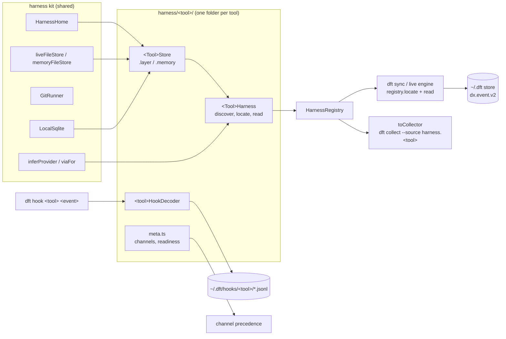

# Harnesses

A harness is one coding tool (`cursor`, `claude-code`, `codex`, `opencode`, `pi`, `omp`, `deepseek`). The UI and CLI call it a "tool" (D43). Each harness turns what its tool leaves on disk into `dx.event.v2` events. Everything lives in `packages/core/src/dx/harness/`.

## The pieces

## Event model v2

`DxEventEnvelope` (`model/event.ts`) keeps identity, flight context (`repoCommonDir`, `worktreePath`, `branch`, `headSha`, `flightId`) and a free `payload`, and adds two typed blocks (`model/attribution.ts`):

| Block | Fields |
| --- | --- |
| `ai: AiAttribution \| null` | `harness`, `harnessVersion`, `channel`, `provider` (model maker), `via` (gateway or null), `model` (normalized), `modelRaw`, `effort`, `effortSource`, `sessionId`, `parentSessionId`, `agentId`, `agentType`, `cwd`, `branchSource` |
| `usage: AiUsage \| null` | `requestKey`, `tokens` (`inputFresh`, `cacheRead`, `cacheWrite5m`, `cacheWrite1h`, `cacheWrite`, `output`, `reasoning` inside output, `total`; `null` means unknown, never `0`), `toolFigure` (`amount`, `currency`, `kind`: `charge`, `list-price` or `api-equivalent`), `serviceTier`, `speed`, `premiumRequests` |

Every `ai.*` event from a harness carries `ai`; non-AI events carry `null` in both. Store migration 2 (`storage/migrations.ts`, `storage/upgrade-v1.ts`) rewrites v1 rows and pending spool batches forward. Collectors that predate harness folders fill the blocks through `withCollectorBlocks` (`harness/collector-blocks.ts`); a new harness builds them directly.

## The per-tool contract

Each tool folder exports, from its `index.ts`:

| Export | Shape |
| --- | --- |
| `<Tool>Store` | `Context.Service` with `HarnessStore`: `roots`, `listSessions` (path, mtime, size), `readText`, `readBytes`, `version`. `.layer` is live (needs `HarnessHome`, `FileSystem`, `Path`), `.memory(input)` is in-memory (a `MemoryFile` holds `text` or raw `bytes`, for compressed sessions). Tools with a database read it through `LocalSqlite`. A tool may widen its own store shape inside its folder. |
| `<Tool>Harness` | `Context.Service` with `Harness`: `id`, `displayName`, `capabilities` (`branchSources`, `storedFigure`, `subagents`, `liveHooks`), `channels` (this tool's precedence, best first), `discover`, `locate(scope)`, `read(ref, input)` returning an `EventBatch` of v2 events. `.layer` needs the store and may use `HarnessHome`, `LocalSqlite` and `GitRunner`; `.mock` is the harness over an empty memory store and needs no filesystem. |
| `<TOOL>_CHANNELS`, `<TOOL>_READINESS` | `meta.ts`. Flip readiness from `unsupported` to `degraded` or `ready` when the tool reads real sessions; that also admits its `harness.<tool>` collector. |
| `<tool>HookDecoder` | `hook.ts`. `decode` turns one hook payload into `HookFields`, `kind` maps the tool's hook event name to an event kind (`other` by default), `respond` returns the stdout the tool needs (empty for most). |

`locate(scope)` returns only sessions that belong to `scope.worktrees` (every ref names one of them in `worktree`); an empty list (`everywhere`) means every session. `read` supports incremental reads: a `SessionRef` carries `mtimeMs` and `size`, and `fileCursorOf` / `readFileCursor` / `unchangedSince` encode a per-file offset in the batch `cursor`. Reading the same ref twice must give the same event ids.

Channel precedence is per harness (`harness/precedence.ts` reads every `meta.ts`); it replaces the old global source list. `HarnessRegistry` assembles all seven harnesses. `HarnessRegistryLive` adds the live kit (`HarnessHome`, `LocalSqlite`, `GitRunner`) for the process home; `harnessRegistryFor(home)` anchors it at a given home and applies the user's folder variables only when that home is the user's own, so a sandbox home never reads real tool data. Sync and the live engine use `harnessRegistryFor(options.home)`, plan git sources themselves and ask `registry.locate(scope)` for everything else, then call `harness.read(ref)`. A failed `locate` shows up as an unavailable sync step.

`HarnessHome.dirs` follows each tool's own rules. OMP mirrors oh-my-pi: `ompConfig` is `~/<PI_CONFIG_DIR or .omp>` (plus `profiles/<PI_PROFILE>`), holding `stats.db`; `omp` is the agent folder (`PI_CODING_AGENT_DIR`, else `<ompConfig>/agent`) with `sessions/`; `ompXdgData` is `$XDG_DATA_HOME/omp` when that variable is set, where OMP moves its data once migrated.

## Branch precedence

Correlation (`correlation/branch-at-time/attribute.ts`) applies D28 to every harness. A branch the tool recorded on the request (`ai.branchSource: "harness-recorded"`) is kept. Otherwise a hook turn of the same session within five minutes gives its branch (`hook`). Then checkout history at that time (`git-at-time`), then the folder, then unassigned. A branch the tool records once per session (Codex `session_meta.git`, the Cursor chat store) is `session-recorded`: it is kept on the event but checkout history overrides it. Cursor events keep their phase 1 rule: only account rows joined to a session take hook turns.

## Live hooks

Tool hooks call `dft hook <tool> <event>` (plain `dft hook` still means Cursor). It reads one JSON payload on stdin, keeps only session id, turn id, cwd, transcript path, model, effort, agent id and type, the event and the branch at that moment (from git), appends one `dft.hook.v1` line to `~/.dft/hooks/<tool>/<date>.jsonl`, never writes into the repo, exits 0 and prints only what the tool needs. Cursor keeps its existing spool.

A harness turns its observations into events in two calls. `locate` adds `hookSpoolRefs(scope, id)` (one `hooks` ref per spool day and worktree; pass `"extension"` as the third argument when an extension or plugin calls `dft hook`), and `read` hands every ref it got from there to `readHookSpool(ref, <tool>HookDecoder, input.origin)`. Each observation becomes one event with `acquisition: "hook"`, the branch the hook saw, and an `ai` block on the ref's channel, so correlation can give the session's requests that branch. `readHookObservations(dftHome, tool)` still returns the raw observations.

## Test tiers

| Tier | Layers | When |
| --- | --- | --- |
| mock | `registryWith(<Tool>Harness.mock)` | always |
| fixture | `<Tool>Harness.layer` + `<Tool>Store.layer` over committed redacted files (`HarnessHome.at(tempHome)`) | always |
| live | `HarnessRegistryLive` over this machine, read-only, invariants only | `DFT_LIVE_HARNESSES=claude-code,codex pnpm --filter @rat-stack/core test:live` |

`harnessConformance(name, registryLayer, { tier, scope })` (`packages/core/test/dx/harness/conformance.ts`) runs the shared checks: discovery never fails and names the harness, located sessions stay inside the scope, events round-trip as v2, every AI event carries attribution for this harness and one of its channels, reading twice gives the same ids, unknown tokens stay null, only tools that store a charge emit one, payloads carry no prompt or message text, branch source matches capabilities, request keys are unique per channel.

## Adding a tool

1. Fill `harness/<tool>/store.ts` (roots and session filter) and `harness/<tool>/harness.ts` (`locate` and `read`; build `ai` and `usage` with `providerFor`, `viaFor`, `normalizeModel`).
2. Put redacted fixtures (real field structure, synthetic text) under `packages/core/test/dx/fixtures/harness/<tool>/` and add `packages/core/test/dx/harness/<tool>.test.ts` running `harnessConformance` at the fixture tier plus the tool's own cases.
3. Fill `hook.ts` if the tool has hooks (add `hookSpoolRefs` / `readHookSpool` to `locate` / `read`), list every branch source the tool can produce in `capabilities.branchSources`, and set readiness in `meta.ts`.
4. Run the live tier on your machine before you ship.

## File ownership for the 0.2.0 fan-out

| Owner | Paths |
| --- | --- |
| Each tool agent (`claude-code`, `codex`, `opencode`, `pi`, `omp`, `deepseek`) | `packages/core/src/dx/harness/<tool>/`, `packages/core/test/dx/harness/<tool>*`, `packages/core/test/dx/fixtures/harness/<tool>/` |
| Cursor migration | `packages/core/src/dx/harness/cursor/`, `packages/core/src/dx/collectors/cursor-*/`, `packages/core/test/dx/harness/cursor*`, `packages/core/test/dx/fixtures/harness/cursor/` |
| Foundation (shared, change only through the orchestrator) | `packages/core/src/dx/harness/*.ts`, `packages/core/src/dx/model/`, `packages/core/src/dx/storage/`, `packages/core/src/dx/registry/`, `packages/core/test/dx/harness/conformance.ts` |

Tool agents never edit another tool's folder or the shared files above. A missing kit capability is asked for, not patched in place. The old `collectors/claude`, `collectors/codex` and `collectors/opencode` importers stay until their tool agent moves the logic into the tool folder and deletes them.
