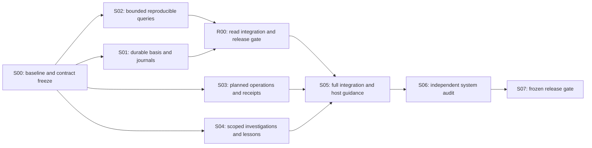

# Agent system implementation plans

Status: completed on `feat/agent-system`. The user authorized the complete follow-up on 2026-10-02. The baseline is `eddcedb29c3900a1e5e365dc3999bf6f7fdcfd7b`. All nine phases and the final frozen artifact passed their gates. [Execution state](execution.json) and the accepted [release receipt](../../docs/execution/phases/s07.json) preserve the checks, historical failures, disclosed limits and owned resource closure.

Design authority: [agent system](../../docs/architecture/agent-system.md), with separate [query](../../docs/architecture/agent-queries.md), [control](../../docs/architecture/agent-control.md) and [learning](../../docs/architecture/agent-learning.md) contracts. Exact selection, dependencies and exclusive write paths: [manifest](manifest.json). The original `dxfr-rat-*` graph is historical and is not part of this selection. Its old deadlines do not govern this follow-up.

## Execute in this order



| Node | Deliverable | Completion evidence |
| --- | --- | --- |
| [S00](s00-contracts.plan.md) | Verified baseline, frozen schemas, ownership and command recipes | Current code/contract map, scope transfer, compile-only fakes and verified command catalog |
| [S01](s01-storage.plan.md) | Durable bases, operation journals and learning records | Migration/reopen, historical binding, revision/idempotency behavior and replay tests |
| [S02](s02-queries.plan.md) | Progressive reads and complete provenance | Pinned calculations, missing refs, bounded computation, query-policy and comparison cases |
| [R00](r00-read-gate.plan.md) | Installed, independently verified read milestone | Same-basis CLI/MCP reads, cheap orientation, disclosures, restart and full fence |
| [S03](s03-operations.plan.md) | Plan/apply/get/cancel with verifiable receipts | Stale-plan, duplicate retry, spool recovery, cancellation and crash cases |
| [S04](s04-learning.plan.md) | Scoped investigation/lesson lifecycle | Resume, applicability, conflicting evaluation, supersession and privacy cases |
| [S05](s05-integration.plan.md) | CLI/MCP/dashboard parity and native host instructions | Same semantic results, honest effects, compatibility and real current-host observation |
| [S06](s06-audit.plan.md) | Independent correctness and resource verdict | End-to-end driving loop, adversarial cases and measured bounded-work results |
| [S07](s07-release.plan.md) | Frozen tested artifact and truthful release receipt | Full fence, install/restart, published contract availability and remaining gaps |

These are implementation assignments, not estimates. R00 is a useful stopping point: status, full basis binding, shared disclosures and recorded-only bounded reads. A separately released read-only artifact keeps operations and learning disabled. The user-authorized complete execution can verify this read predicate on the same fully enabled frozen artifact used for the full gate, with distinct read and connected-system receipts. Its read-milestone receipt identifies the enabled set and cannot claim the whole loop is complete. The full follow-up verdict requires all nine nodes' behavior evidence.

## Ownership and admission

The user authorized execution of the whole plan with maximal useful parallelism. Root activated the manifest's source ownership on `feat/agent-system` after confirming prior native agents performed only completed read-only research. S00 freezes shared ports first. S01-S04 then implement concurrently against those ports and fake services; they do not wait for concrete storage or the read release. R00 can prepare its integration at freeze, but its gate requires S01/S02. S05 and the final gate require all producer results. [Execution state](execution.json) records live ownership and progress.

S00 owns contracts/model and the exact command catalog. S01 owns storage/migrations. S02 owns query/report/reconciliation/price-book work. One integration owner holds a sequential R00 then S05 baton for app composition, shared registration, packaged guidance and installation. S03 owns operation orchestration, live administration and exactly `registry/sync.ts`; S04 owns learning. Producers do not edit shared registration, composition or barrels. S06 reports fixes to the responsible owner. Root is release authority for R00 and S07.

Every worker receives an exact path set, dependencies, frozen contract digest, named inputs, resource limits and a completion criterion. Workers are not alone in the codebase; preserve others' edits and accommodate accepted interfaces. Reassign a cross-owner change explicitly rather than broadening a worker's scope. Reserve the integration/audit lane and use concurrency only for independent work. Share one dependency tree and one full-suite queue.

## Contracts before producers

Freeze scope/store generation, analysis basis, typed references, read policies, response context, paging/work continuations, comparison semantics, operation plans/receipts, investigation/lesson/evaluation schemas and failure unions. Define optional v1 additions and negotiated new requirements separately. A breaking shape or meaning requires a new version; event v2 does not imply that capability contracts or report schemas were upgraded.

Schema examples and names in the design docs are proposed. S00 verifies current installed Effect/XState instructions and APIs before implementing them. Compile-only fakes must let S02/S03/S04 develop without real source access or a running dashboard. Fixture origin never enters the live store.

## Verification and handoff

Use the per-owner recipes in [commands.json](../../docs/execution/commands.json) exactly. The S00 owner publishes new verified app/audit commands there before use; unverified commands are labelled prospective. Existing starting tests are `b36`, `b37`, `b38`, `b39`, usage/incremental/scale, sync-cursors, price-book/catalog, live-engine and restore-old-backup. Existing app tests include dft, dft-usage, dft-live, dft-surfaces and dft-retention. Test filenames do not prove current behavior; inspect them before extending them.

New isolated tests use `packages/core/test/dx/<node>.test.ts` and fixture directories `test/dx/fixtures/<node>/`, including `r00`, so the prescribed core command is `pnpm --filter @rat-stack/core exec vitest run test/dx/<node>.test.ts`. Use Effect test conventions. Before typechecking, obtain fresh TraceDecay diagnostics. Only root's R00/S07 release coordinator runs `pnpm exec turbo run check test build`, matching the command catalog's gate argv. Preserve the fence and exact dependency pins. On a busy shared host, choose a positive `VITEST_MAX_WORKERS` value before the gate. Turbo forwards it only to test tasks. Each package limits its own workers while package tasks remain parallel. Keep test selection, assertions and deadlines unchanged; record the chosen value in the receipt.

Handoffs at `docs/execution/nodes/<node>.json|.md` name contract digest, owned paths, test results, runtime versions, supported states, resource measurements and gaps. Gate acceptance requires successful exit, complete passing reports for every required task and unchanged source and compiled artifact identities. A cancelled or interrupted run remains unverified even if its wrapper exits zero. Record skipped tests separately. Pending implementation stays pending. A tested disabled descriptor is not implemented support. Generated dependency/build trees have an explicit owner and release path; existing user data and other sessions' outputs remain intact.

## Select and validate the graph

The manifest is the exact selection, including explicit edges. Do not use `plans/*.plan.md` or combine historical frontmatter with this graph. Where the plan-graph skill is installed, invoke its checker with an explicit graph ID, every manifest plan as a repeated `--plan`, and every edge as `--depends source-name:target-name`.

```text
python3 <plan-graph-skill>/scripts/plan_graph.py validate
  --graph-id dft-agent-system-v1 --strict --format json
  [exact --plan and --depends arguments from manifest.json]
```

`dag --format mermaid` and `frontier --format json` use the same selection and graph ID. A graph check validates ordering and metadata, not runtime acceptance. The checked-in [validation receipt](validation.json) records this design revision's graph check only. S00 revalidates before dispatch and confirms which source-path claims can activate.
