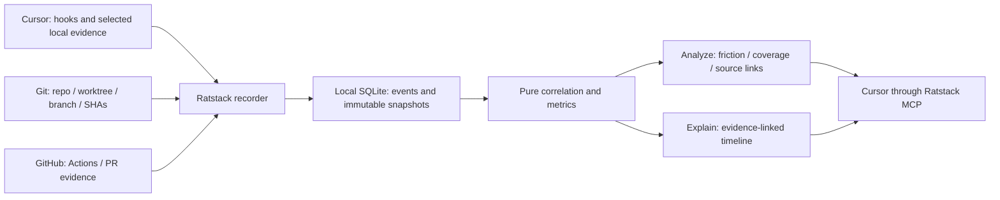

# dx-feature-tracker: Cursor-first walkthrough

Standalone Ratstack product. Four-hour execution deadline. All product implementation and runtime proof are pending. This view explains the validated plan, not a shipped application.

## Proposed solution



The commands read a recorded snapshot. They do not silently collect new data or depend on another product. Hooks feed future activity; selected exports/databases recover available history. GitHub contributes imported CI/PR evidence. MCP is the reporting interface, not a complete recorder of Cursor activity.

## Stopping points

| Phase | Visible result | Promotion proof |
|---|---|---|
| P0 | Built Ratstack server and frozen source/model interfaces | SQLite/reopen, MCP handshake, verified commands and full checks |
| P1 / v0 | Actual Cursor analyze/explain: real Git plus labelled replay AI/CI | Deterministic replay, correct arithmetic/redaction, installed built package, Cursor observation and restart |
| P2 / v1 | Actual real flight: Git + one real Cursor AI route + CI/PR | Real-input receipts, source coverage, composed end-to-end test, Cursor rehearsal and prior regressions |
| P3 / v2 | Validated additional sources or metrics | Per-extension version/layout/accounting/privacy checks, real receipts when live claimed and full regressions |
| P4 | Frozen demo-ready release | Clean configuration/restart, same pre-restart snapshot, final checks and claims review |

Every promotion runs `pnpm turbo run check test build` through one queue after A01 verifies the actual scaffold command. Stop at any passed milestone. Preserve the named passing artifact and sanitized demo bundle. Failed or unfinished extensions cannot replace the last green demo. No GitHub access means degraded-live, not full v1 live-core. No actual Cursor observation means client-unverified.

## Cursor capture and accuracy

```text
Capture routes, in priority order
├── Agent / edit / tool / shell / Tab hooks
│   └── future activity only; installed-build event coverage must be verified
├── selected transcripts and local Cursor databases / AI tracking
│   └── import available history; reject unknown schemas and preserve gaps
├── personal usage export
│   └── supplied token/cost categories; flight allocation may be unresolved
└── optional SDK / dashboard-response / CLI / provenance imports
    └── independent traffic scopes; do not sum overlapping requests
```

Prefer hooks for prospective Cursor activity. A real transcript or personal export is a non-admin fallback if hooks are unsupported, but does not prove live capture. Optional native stop-hook token fields are captured when present; incremental/cumulative behavior must be verified before summing. Context occupancy is not billable usage. Local DB/AI tracking is a promising adapter, not a universal guarantee.

Each observation records source/version, origin, observed time versus source time, repository/worktree/flight, observed branch/SHA, upstream IDs when supplied and evidence reference. Renamed branches do not create a new flight; rebases preserve observed SHA history. Missing IDs or historical branch mapping remain provisional/unassigned. Cross-source request overlap is resolved or shown separately.

Precision is reported per field, not by one global confidence badge. Flight span is wall clock. CI execution is interval union; compute is sum of job durations. Human waiting needs an explicit blocked marker. Strict AI survival needs observed edit lineage and a named checkpoint. Unknown edits are not automatically human; missing cost is not zero.

## Proof that it works in Cursor

```text
Actual installed Cursor, selected demo repository
  launch the built MCP executable from installed config
  initialize MCP and record negotiated protocol/version
  tools/list includes expected recorder capabilities
  invoke /dx-analyze or disclose tested direct-tool fallback
  invoke /dx-explain with analyze's snapshotId
  follow one source/evidence reference
  restart server/client
  explain same snapshotId -> same facts or explicit version error
```

For capture proof, install the supported hooks, start a short real flight, and have the authorized Cursor operator generate an edit and tool/test action supported by that build. Compare the hook/spool receipt with the stored event and timeline. Correlate the actual session/request IDs when present. Repeat two turns and test duplicate emissions; branch/worktree changes must not be silently assigned to the wrong flight. If hook capture fails, disclose import-only operation rather than showing a synthetic event as live.

A source receipt records version, input hash/local reference, record count, supported fields and coverage gaps. The client receipt records build/config/client versions, protocol, returned snapshot ID, routing and observable output. Gate success requires both for a claimed real flight; parser tests alone are insufficient.

## Hackathon presentation

```text
1. State the problem
   "Cursor helps developers write code.
    dx-feature-tracker shows how their development actually went."

2. Show capture in Cursor
   branch -> small AI edit -> observed tool/test action -> event receipt

3. Ask /dx-analyze
   show flight, actual evidence totals, friction candidate and coverage

4. Ask /dx-explain
   inspect ordered events, source link and repeated feedback

5. Show why the numbers are trustworthy
   inspect one calculation and one missing/unassigned field
   restart and reuse the same snapshot
```

Use a real look-back flight with existing GitHub history so stage CI does not gate the presentation. Keep a short prospective Cursor flight beside it to prove live capture. Use a separate labelled replay for overlap/reruns/ambiguous attribution if the real flight has no such events. Never mix those origins or invent savings. The dashboard is optional; the primary interface is Cursor.

## Parallel execution

```text
Root: phases / priority / evidence / hard stop
├── 48 independent module lanes after contract freeze
├── one integration owner: v0 -> v1 -> extensions
└── core validators / repairs, with four reserved worker slots
```

79 bounded assignments run across waves within root +49 workers. Core presentation and verification take priority over optional breadth. At T+150 freeze extensions; from T+180 release fixes only; by T+210 rehearse; at T+240 stop at highest passing artifact. These are cut policies, not effort estimates.

[Detailed phase gates](phase-gates.md), [execution policy](hackathon-execution.md), [assignment index](plan-index.md) and [Factory review dispositions](reviews/feedback-dispositions.md).
